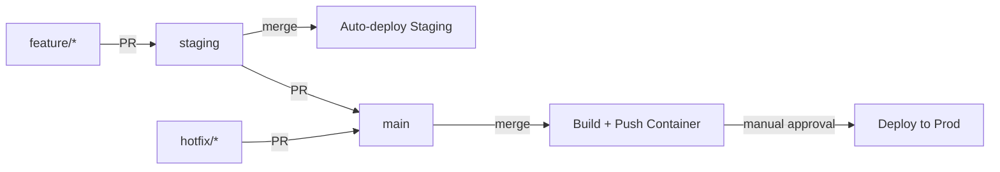

# GitOps Workflow - Interlinear

Lightweight, professional CI/CD with gated production deploys.

## Branch Strategy

```
main        → Production (manual deploy gate)
staging     → Staging (auto-deploy)
feature/*   → Dev work (PR to staging)
hotfix/*    → Emergency fixes (PR to main)
```

## Workflow Overview



## Workflow Files

### 1. PR Checks (`pr-check.yml`)
**Triggers**: All PRs to `main` or `staging`
**Purpose**: Quality gates before merge

```yaml
name: PR Checks

on:
  pull_request:
    branches: [main, staging]

jobs:
  quality-checks:
    runs-on: ubuntu-latest
    timeout-minutes: 15

    steps:
      - uses: actions/checkout@v4

      - name: Setup Node
        uses: actions/setup-node@v4
        with:
          node-version: '20'
          cache: 'npm'

      - name: Install dependencies
        run: npm ci

      - name: Type check
        run: npm run type-check

      - name: Lint
        run: npm run lint

      - name: Build
        run: npm run build
        env:
          NEXT_PUBLIC_SUPABASE_URL: ${{ secrets.NEXT_PUBLIC_SUPABASE_URL }}
          NEXT_PUBLIC_SUPABASE_ANON_KEY: ${{ secrets.NEXT_PUBLIC_SUPABASE_ANON_KEY }}

      # Optional: E2E tests (add when ready)
      # - name: Install Playwright
      #   run: npx playwright install --with-deps
      #
      # - name: Run E2E tests
      #   run: npm run test:e2e
      #   env:
      #     NEXT_PUBLIC_SUPABASE_URL: ${{ secrets.NEXT_PUBLIC_SUPABASE_URL }}
      #     NEXT_PUBLIC_SUPABASE_ANON_KEY: ${{ secrets.NEXT_PUBLIC_SUPABASE_ANON_KEY }}

  # Build container to verify Dockerfile works
  container-build-test:
    runs-on: ubuntu-latest
    timeout-minutes: 20

    steps:
      - uses: actions/checkout@v4

      - name: Set up Docker Buildx
        uses: docker/setup-buildx-action@v3

      - name: Build container (test only)
        uses: docker/build-push-action@v5
        with:
          context: .
          push: false
          build-args: |
            NEXT_PUBLIC_SUPABASE_URL=${{ secrets.NEXT_PUBLIC_SUPABASE_URL }}
            NEXT_PUBLIC_SUPABASE_ANON_KEY=${{ secrets.NEXT_PUBLIC_SUPABASE_ANON_KEY }}
          cache-from: type=gha
          cache-to: type=gha,mode=max
```

**Status**: ✅ REQUIRED - PRs blocked until passing

---

### 2. Staging Auto-Deploy (`staging-deploy.yml`)
**Triggers**: Merge to `staging` branch
**Purpose**: Immediate deployment to staging environment

```yaml
name: Deploy to Staging

on:
  push:
    branches: [staging]

env:
  PROJECT_ID: ${{ secrets.GCP_PROJECT_ID }}
  REGION: us-east4
  REGISTRY: us-east4-docker.pkg.dev
  ENVIRONMENT: staging

jobs:
  deploy:
    runs-on: ubuntu-latest
    environment: staging
    timeout-minutes: 25

    permissions:
      contents: read
      id-token: write

    steps:
      - uses: actions/checkout@v4

      - name: Authenticate to Google Cloud
        uses: google-github-actions/auth@v2
        with:
          credentials_json: ${{ secrets.GCP_SA_KEY }}

      - name: Set up Cloud SDK
        uses: google-github-actions/setup-gcloud@v2

      - name: Configure Docker for Artifact Registry
        run: gcloud auth configure-docker ${{ env.REGION }}-docker.pkg.dev

      - name: Get short SHA
        id: vars
        run: |
          echo "short_sha=$(git rev-parse --short HEAD)" >> $GITHUB_OUTPUT
          echo "timestamp=$(date +%Y%m%d-%H%M%S)" >> $GITHUB_OUTPUT

      - name: Build and push container
        run: |
          docker build \
            --build-arg NEXT_PUBLIC_SUPABASE_URL="${{ secrets.NEXT_PUBLIC_SUPABASE_URL }}" \
            --build-arg NEXT_PUBLIC_SUPABASE_ANON_KEY="${{ secrets.NEXT_PUBLIC_SUPABASE_ANON_KEY }}" \
            -t ${{ env.REGISTRY }}/${{ env.PROJECT_ID }}/interlinear/app:staging-${{ steps.vars.outputs.short_sha }} \
            -t ${{ env.REGISTRY }}/${{ env.PROJECT_ID }}/interlinear/app:staging-latest \
            .

          docker push ${{ env.REGISTRY }}/${{ env.PROJECT_ID }}/interlinear/app:staging-${{ steps.vars.outputs.short_sha }}
          docker push ${{ env.REGISTRY }}/${{ env.PROJECT_ID }}/interlinear/app:staging-latest

      - name: Deploy to Cloud Run
        run: |
          gcloud run deploy interlinear-staging \
            --image=${{ env.REGISTRY }}/${{ env.PROJECT_ID }}/interlinear/app:staging-${{ steps.vars.outputs.short_sha }} \
            --region=${{ env.REGION }} \
            --platform=managed \
            --allow-unauthenticated \
            --set-env-vars="NEXT_PUBLIC_SUPABASE_URL=${{ secrets.NEXT_PUBLIC_SUPABASE_URL }}" \
            --set-secrets="NEXT_PUBLIC_SUPABASE_ANON_KEY=supabase-anon-key-staging:latest,ELEVENLABS_API_KEY=elevenlabs-api-key-staging:latest,OPENAI_API_KEY=openai-api-key-staging:latest" \
            --cpu=1 \
            --memory=512Mi \
            --min-instances=0 \
            --max-instances=3 \
            --timeout=60s \
            --quiet

      - name: Get service URL
        id: url
        run: |
          URL=$(gcloud run services describe interlinear-staging \
            --region=${{ env.REGION }} \
            --format='value(status.url)')
          echo "url=$URL" >> $GITHUB_OUTPUT

      - name: Deployment summary
        run: |
          echo "## 🚀 Staging Deployment Complete" >> $GITHUB_STEP_SUMMARY
          echo "" >> $GITHUB_STEP_SUMMARY
          echo "**Environment**: Staging" >> $GITHUB_STEP_SUMMARY
          echo "**Image**: \`staging-${{ steps.vars.outputs.short_sha }}\`" >> $GITHUB_STEP_SUMMARY
          echo "**URL**: ${{ steps.url.outputs.url }}" >> $GITHUB_STEP_SUMMARY
          echo "" >> $GITHUB_STEP_SUMMARY
          echo "### Quick Test" >> $GITHUB_STEP_SUMMARY
          echo "\`\`\`bash" >> $GITHUB_STEP_SUMMARY
          echo "curl ${{ steps.url.outputs.url }}" >> $GITHUB_STEP_SUMMARY
          echo "\`\`\`" >> $GITHUB_STEP_SUMMARY
```

**Behavior**: Fully automated, no approval needed
**Speed**: ~3-5 minutes from merge to live

---

### 3. Production Build (`prod-build.yml`)
**Triggers**: Merge to `main` branch
**Purpose**: Build and push production container (no deploy)

```yaml
name: Production Build

on:
  push:
    branches: [main]

env:
  PROJECT_ID: ${{ secrets.GCP_PROJECT_ID }}
  REGION: us-east4
  REGISTRY: us-east4-docker.pkg.dev
  ENVIRONMENT: production

jobs:
  build:
    runs-on: ubuntu-latest
    environment: production
    timeout-minutes: 25

    permissions:
      contents: read
      id-token: write

    steps:
      - uses: actions/checkout@v4

      - name: Authenticate to Google Cloud
        uses: google-github-actions/auth@v2
        with:
          credentials_json: ${{ secrets.GCP_SA_KEY }}

      - name: Set up Cloud SDK
        uses: google-github-actions/setup-gcloud@v2

      - name: Configure Docker for Artifact Registry
        run: gcloud auth configure-docker ${{ env.REGION }}-docker.pkg.dev

      - name: Get version info
        id: vars
        run: |
          echo "short_sha=$(git rev-parse --short HEAD)" >> $GITHUB_OUTPUT
          echo "full_sha=$(git rev-parse HEAD)" >> $GITHUB_OUTPUT
          echo "timestamp=$(date +%Y%m%d-%H%M%S)" >> $GITHUB_OUTPUT

      - name: Build and push container
        run: |
          docker build \
            --build-arg NEXT_PUBLIC_SUPABASE_URL="${{ secrets.NEXT_PUBLIC_SUPABASE_URL_PROD }}" \
            --build-arg NEXT_PUBLIC_SUPABASE_ANON_KEY="${{ secrets.NEXT_PUBLIC_SUPABASE_ANON_KEY_PROD }}" \
            -t ${{ env.REGISTRY }}/${{ env.PROJECT_ID }}/interlinear/app:prod-${{ steps.vars.outputs.short_sha }} \
            -t ${{ env.REGISTRY }}/${{ env.PROJECT_ID }}/interlinear/app:prod-${{ steps.vars.outputs.timestamp }} \
            -t ${{ env.REGISTRY }}/${{ env.PROJECT_ID }}/interlinear/app:prod-latest \
            .

          docker push ${{ env.REGISTRY }}/${{ env.PROJECT_ID }}/interlinear/app:prod-${{ steps.vars.outputs.short_sha }}
          docker push ${{ env.REGISTRY }}/${{ env.PROJECT_ID }}/interlinear/app:prod-${{ steps.vars.outputs.timestamp }}
          docker push ${{ env.REGISTRY }}/${{ env.PROJECT_ID }}/interlinear/app:prod-latest

      - name: Build summary
        run: |
          echo "## 📦 Production Build Complete" >> $GITHUB_STEP_SUMMARY
          echo "" >> $GITHUB_STEP_SUMMARY
          echo "**Commit**: \`${{ steps.vars.outputs.short_sha }}\`" >> $GITHUB_STEP_SUMMARY
          echo "**Images tagged**:" >> $GITHUB_STEP_SUMMARY
          echo "- \`prod-${{ steps.vars.outputs.short_sha }}\` (commit SHA)" >> $GITHUB_STEP_SUMMARY
          echo "- \`prod-${{ steps.vars.outputs.timestamp }}\` (timestamp)" >> $GITHUB_STEP_SUMMARY
          echo "- \`prod-latest\` (rolling)" >> $GITHUB_STEP_SUMMARY
          echo "" >> $GITHUB_STEP_SUMMARY
          echo "### ⏭️ Next Step: Deploy to Production" >> $GITHUB_STEP_SUMMARY
          echo "" >> $GITHUB_STEP_SUMMARY
          echo "Go to [Actions → Deploy to Production](${{ github.server_url }}/${{ github.repository }}/actions/workflows/prod-deploy.yml)" >> $GITHUB_STEP_SUMMARY
          echo "" >> $GITHUB_STEP_SUMMARY
          echo "Select \`Run workflow\` and use image tag: \`prod-${{ steps.vars.outputs.short_sha }}\`" >> $GITHUB_STEP_SUMMARY
```

**Behavior**: Build only, no deployment
**Next Step**: Manual workflow dispatch required

---

### 4. Production Deploy (`prod-deploy.yml`)
**Triggers**: Manual `workflow_dispatch`
**Purpose**: Gated deployment to production

```yaml
name: Deploy to Production

on:
  workflow_dispatch:
    inputs:
      image_tag:
        description: 'Image tag to deploy (e.g., prod-abc1234)'
        required: true
        type: string
      skip_healthcheck:
        description: 'Skip post-deployment health check'
        required: false
        type: boolean
        default: false

env:
  PROJECT_ID: ${{ secrets.GCP_PROJECT_ID }}
  REGION: us-east4
  REGISTRY: us-east4-docker.pkg.dev
  ENVIRONMENT: production

jobs:
  deploy:
    runs-on: ubuntu-latest
    environment: production  # Requires approval in GitHub settings
    timeout-minutes: 15

    permissions:
      contents: read
      id-token: write

    steps:
      - uses: actions/checkout@v4

      - name: Validate image tag
        run: |
          if [[ ! "${{ inputs.image_tag }}" =~ ^prod- ]]; then
            echo "❌ Error: Image tag must start with 'prod-'"
            echo "   Example: prod-abc1234"
            exit 1
          fi

      - name: Authenticate to Google Cloud
        uses: google-github-actions/auth@v2
        with:
          credentials_json: ${{ secrets.GCP_SA_KEY }}

      - name: Set up Cloud SDK
        uses: google-github-actions/setup-gcloud@v2

      - name: Verify image exists
        run: |
          if ! gcloud artifacts docker images describe \
            ${{ env.REGISTRY }}/${{ env.PROJECT_ID }}/interlinear/app:${{ inputs.image_tag }} \
            --format=json > /dev/null 2>&1; then
            echo "❌ Error: Image not found in registry"
            echo "   Image: ${{ inputs.image_tag }}"
            exit 1
          fi
          echo "✅ Image found in registry"

      - name: Deploy to Cloud Run
        run: |
          gcloud run deploy interlinear-prod \
            --image=${{ env.REGISTRY }}/${{ env.PROJECT_ID }}/interlinear/app:${{ inputs.image_tag }} \
            --region=${{ env.REGION }} \
            --platform=managed \
            --allow-unauthenticated \
            --set-env-vars="NEXT_PUBLIC_SUPABASE_URL=${{ secrets.NEXT_PUBLIC_SUPABASE_URL_PROD }}" \
            --set-secrets="NEXT_PUBLIC_SUPABASE_ANON_KEY=supabase-anon-key-prod:latest,ELEVENLABS_API_KEY=elevenlabs-api-key-prod:latest,OPENAI_API_KEY=openai-api-key-prod:latest" \
            --cpu=2 \
            --memory=1Gi \
            --min-instances=1 \
            --max-instances=10 \
            --timeout=60s \
            --quiet

      - name: Get service URL
        id: url
        run: |
          URL=$(gcloud run services describe interlinear-prod \
            --region=${{ env.REGION }} \
            --format='value(status.url)')
          echo "url=$URL" >> $GITHUB_OUTPUT

      - name: Health check
        if: ${{ !inputs.skip_healthcheck }}
        run: |
          echo "⏳ Waiting 10s for service to stabilize..."
          sleep 10

          echo "🔍 Running health check..."
          HTTP_CODE=$(curl -o /dev/null -s -w "%{http_code}" ${{ steps.url.outputs.url }})

          if [ "$HTTP_CODE" -eq 200 ]; then
            echo "✅ Health check passed (HTTP $HTTP_CODE)"
          else
            echo "⚠️  Health check returned HTTP $HTTP_CODE"
            echo "   Manual verification recommended"
          fi

      - name: Deployment summary
        run: |
          echo "## 🎉 Production Deployment Complete" >> $GITHUB_STEP_SUMMARY
          echo "" >> $GITHUB_STEP_SUMMARY
          echo "**Environment**: Production" >> $GITHUB_STEP_SUMMARY
          echo "**Image**: \`${{ inputs.image_tag }}\`" >> $GITHUB_STEP_SUMMARY
          echo "**URL**: ${{ steps.url.outputs.url }}" >> $GITHUB_STEP_SUMMARY
          echo "**Deployed by**: @${{ github.actor }}" >> $GITHUB_STEP_SUMMARY
          echo "" >> $GITHUB_STEP_SUMMARY
          echo "### 🔍 Verify Deployment" >> $GITHUB_STEP_SUMMARY
          echo "- [ ] Home page loads" >> $GITHUB_STEP_SUMMARY
          echo "- [ ] Login/signup works" >> $GITHUB_STEP_SUMMARY
          echo "- [ ] Reader functionality intact" >> $GITHUB_STEP_SUMMARY
          echo "- [ ] Audio generation works" >> $GITHUB_STEP_SUMMARY
          echo "" >> $GITHUB_STEP_SUMMARY
          echo "### 🔄 Rollback if Needed" >> $GITHUB_STEP_SUMMARY
          echo "\`\`\`bash" >> $GITHUB_STEP_SUMMARY
          echo "# List recent revisions" >> $GITHUB_STEP_SUMMARY
          echo "gcloud run revisions list --service=interlinear-prod --region=${{ env.REGION }}" >> $GITHUB_STEP_SUMMARY
          echo "" >> $GITHUB_STEP_SUMMARY
          echo "# Rollback to previous" >> $GITHUB_STEP_SUMMARY
          echo "gcloud run services update-traffic interlinear-prod \\" >> $GITHUB_STEP_SUMMARY
          echo "  --to-revisions=<revision-name>=100 \\" >> $GITHUB_STEP_SUMMARY
          echo "  --region=${{ env.REGION }}" >> $GITHUB_STEP_SUMMARY
          echo "\`\`\`" >> $GITHUB_STEP_SUMMARY
```

**Behavior**: Manual trigger only, requires approval
**Safety**: Image validation + health checks + rollback instructions

---

## GitHub Environment Setup

### Required Environments
Create in: `Settings → Environments`

**staging**
- Protection rules: None (auto-deploy)
- Secrets: Same as repository

**production**
- Protection rules: ✅ Required reviewers (you + 1 other)
- Secrets: Production credentials (if different)

---

## Required Secrets

### Repository Secrets
```
GCP_SA_KEY                          # Service account JSON key
GCP_PROJECT_ID                      # GCP project ID
NEXT_PUBLIC_SUPABASE_URL            # Staging Supabase URL
NEXT_PUBLIC_SUPABASE_ANON_KEY       # Staging Supabase key
NEXT_PUBLIC_SUPABASE_URL_PROD       # Production Supabase URL (if different)
NEXT_PUBLIC_SUPABASE_ANON_KEY_PROD  # Production Supabase key (if different)
```

### GCP Secret Manager
```
supabase-anon-key-staging
supabase-anon-key-prod
elevenlabs-api-key-staging
elevenlabs-api-key-prod
openai-api-key-staging
openai-api-key-prod
```

---

## Developer Workflow

### Feature Development
```bash
# 1. Create feature branch
git checkout -b feature/new-thing

# 2. Develop and commit
git add .
git commit -m "feat: add new thing"

# 3. Push and create PR to staging
git push origin feature/new-thing

# 4. PR checks run automatically
# - Type check, lint, build, container test

# 5. After approval, merge to staging
# - Auto-deploys to staging environment
# - Test in staging

# 6. Create PR from staging to main
# - Same PR checks run

# 7. After approval, merge to main
# - Container builds automatically
# - Tagged with commit SHA

# 8. Deploy to production (manual)
# - Go to Actions → Deploy to Production
# - Select "Run workflow"
# - Enter image tag from build summary
# - Click "Run workflow"
# - Approve deployment (if protection enabled)
```

### Hotfix
```bash
# 1. Create hotfix branch from main
git checkout main
git pull
git checkout -b hotfix/critical-bug

# 2. Fix and commit
git add .
git commit -m "fix: critical bug"

# 3. PR directly to main
git push origin hotfix/critical-bug

# 4. Fast-track review and merge
# - Container builds on merge

# 5. Deploy immediately
# - Run production deploy workflow
# - Use new image tag
```

---

## Rollback Procedures

### Staging Rollback
```bash
# List recent revisions
gcloud run revisions list \
  --service=interlinear-staging \
  --region=us-east4 \
  --limit=5

# Rollback to specific revision
gcloud run services update-traffic interlinear-staging \
  --to-revisions=interlinear-staging-00042=100 \
  --region=us-east4
```

### Production Rollback
**Option 1: Use GitHub Actions**
- Go to Actions → Deploy to Production
- Run workflow with previous good image tag
- Example: `prod-abc1234` (from earlier build)

**Option 2: Manual via gcloud**
```bash
gcloud run revisions list \
  --service=interlinear-prod \
  --region=us-east4

gcloud run services update-traffic interlinear-prod \
  --to-revisions=<good-revision>=100 \
  --region=us-east4
```

---

## Monitoring & Observability

### Quick Health Checks
```bash
# Staging
curl https://interlinear-staging-xxxx.a.run.app

# Production
curl https://interlinear-prod-xxxx.a.run.app
```

### Logs
```bash
# Staging logs (tail)
gcloud run services logs tail interlinear-staging \
  --region=us-east4

# Production errors only
gcloud run services logs read interlinear-prod \
  --region=us-east4 \
  --filter='severity>=ERROR' \
  --limit=50
```

### Metrics
- **Cloud Console**: Cloud Run → Services → Metrics
- **Key metrics**: Request count, latency, error rate, CPU/memory

---

## Cost Optimization

### Staging
- `min-instances=0`: Scales to zero when not used
- `max-instances=3`: Limits cost during testing
- **Estimated cost**: $0-5/month

### Production
- `min-instances=1`: Always-on for fast response
- `max-instances=10`: Handles traffic spikes
- **Estimated cost**: $15-30/month

### Budget Alerts
Set up in GCP Console → Billing → Budgets:
- Alert at 50%: $10/month
- Alert at 90%: $18/month
- Hard limit: $25/month

---

## Best Practices

✅ **DO**:
- Always PR to staging first
- Test in staging before promoting to main
- Use descriptive commit messages (conventional commits)
- Review build summaries before deploying to prod
- Keep image tags for at least 30 days for rollback

❌ **DON'T**:
- Push directly to main or staging
- Deploy to prod without staging verification
- Use `latest` tag for production deploys
- Skip PR checks (force merge)
- Delete old images immediately

---

## Troubleshooting

### Build Fails in CI
1. Check GitHub Actions logs
2. Run locally: `npm run build`
3. Verify secrets are set correctly
4. Check for TypeScript errors

### Deployment Fails
1. Check image exists in Artifact Registry
2. Verify secrets in Secret Manager
3. Check Cloud Run service logs
4. Validate environment variables

### Staging Works, Prod Doesn't
1. Verify production secrets are different/correct
2. Check production Supabase configuration
3. Compare environment variables between environments
4. Check for hardcoded staging URLs

---

## Summary

**Lightweight**: 4 workflows, minimal complexity
**Professional**: Quality gates, approval flows, rollback ready
**Fast**: Staging deploys in 3-5 minutes
**Safe**: Gated production, manual approval required
**Cost-effective**: No preview environments, efficient resource usage

**Total setup time**: ~30 minutes
**Ongoing maintenance**: Minimal
