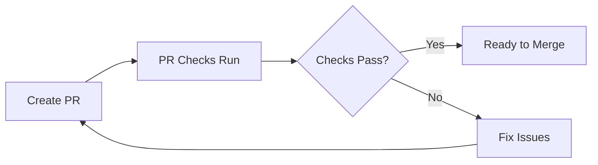
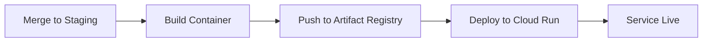

# Staging CI/CD - Ready to Deploy! 🚀

Your staging CI/CD pipeline is fully configured and ready to test.

## Current Status: ✅ All Prerequisites Complete

### GCP Infrastructure (Project: `interlinear-93`)

✅ **APIs Enabled**:
- Cloud Run API
- Artifact Registry API
- Secret Manager API

✅ **Artifact Registry**:
- Repository: `us-east4-docker.pkg.dev/interlinear-93/interlinear`
- Format: Docker
- Location: us-east4

✅ **Service Account**:
- Name: `github-actions-staging@interlinear-93.iam.gserviceaccount.com`
- Key file: `github-actions-staging-key.json` (generated today)
- Roles:
  - Artifact Registry Writer
  - Cloud Run Admin
  - Secret Manager Secret Accessor
  - Service Account User

✅ **Secret Manager Secrets**:
- `supabase-anon-key-staging` ✅
- `elevenlabs-api-key-staging` ✅
- `openai-api-key-staging` ✅

### GitHub Configuration

✅ **Workflows Ready**:
- `.github/workflows/pr-check.yml` - Quality gates for all PRs
- `.github/workflows/staging-deploy.yml` - Auto-deploy to staging

📋 **Secrets to Add** (see `GITHUB_SECRETS_SETUP.md`):
You need to add 4 repository secrets:

1. **`GCP_PROJECT_ID`** = `interlinear-93`
2. **`GCP_SA_KEY`** = Contents of `github-actions-staging-key.json`
3. **`NEXT_PUBLIC_SUPABASE_URL`** = Your Supabase project URL
4. **`NEXT_PUBLIC_SUPABASE_ANON_KEY`** = Your Supabase anon key

## Quick Start Guide

### 1. Add GitHub Secrets (5 minutes)

Follow: `docs/GITHUB_SECRETS_SETUP.md`

Key steps:
- Go to GitHub repo → Settings → Secrets and variables → Actions
- Add the 4 secrets listed above
- The service account key is in: `github-actions-staging-key.json`

### 2. Test the Pipeline (10 minutes)

Follow: `docs/DEPLOYMENT_TEST_WALKTHROUGH.md`

Quick version:
```bash
# 1. Create staging branch
git checkout main && git pull
git checkout -b staging
git push -u origin staging

# 2. Create test feature
git checkout -b feature/test-cicd
echo "# Test" >> TEST.md
git add TEST.md
git commit -m "test: CI/CD pipeline"
git push -u origin feature/test-cicd

# 3. Create PR to staging on GitHub
# 4. Watch checks run
# 5. Merge → auto-deploy!
```

### 3. Verify Deployment

After merge, the app will deploy to:
`https://interlinear-staging-xxxxx.a.run.app`

Test it:
```bash
# Get URL
gcloud run services describe interlinear-staging \
  --region=us-east4 \
  --format='value(status.url)' \
  --project=interlinear-93

# Health check
curl <URL>

# View logs
gcloud run services logs tail interlinear-staging \
  --region=us-east4 \
  --project=interlinear-93
```

## Documentation Index

All setup guides created:

1. **`STAGING_SETUP_GUIDE.md`** - Complete infrastructure setup (reference)
2. **`GITHUB_SECRETS_SETUP.md`** - GitHub secrets configuration (⭐ START HERE)
3. **`DEPLOYMENT_TEST_WALKTHROUGH.md`** - End-to-end testing guide (⭐ THEN THIS)
4. **`GITOPS_WORKFLOW.md`** - Full workflow documentation (reference)

## What Happens When You Deploy?

### On PR to Staging:


**PR Checks** (~5-7 min):
- Type checking
- Linting
- Build test
- E2E tests (Playwright)
- Docker container build test

### On Merge to Staging:


**Auto-Deploy** (~3-5 min):
- Build Docker image with app code
- Push to `us-east4-docker.pkg.dev/interlinear-93/interlinear/app:staging-<sha>`
- Deploy to Cloud Run service `interlinear-staging`
- Service auto-scales (min=0, max=3 instances)

## Expected Costs

**Staging Environment**:
- Storage (Artifact Registry): ~$0.10/GB/month
- Cloud Run: $0-5/month (scales to zero when idle)
- Secret Manager: Free (first 6 secrets)

**Total**: ~$1-5/month

Set budget alerts:
- GCP Console → Billing → Budgets
- Alert at $5/month threshold

## Troubleshooting

### If deployment fails:

1. **Check GitHub Actions logs** - Click on failed workflow → See error
2. **Check GCP permissions** - Run: `gcloud projects get-iam-policy interlinear-93`
3. **Check Cloud Run logs** - Run: `gcloud run services logs read interlinear-staging`
4. **Verify secrets** - Run: `gcloud secrets list --project=interlinear-93`

Common issues:
- ❌ Missing GitHub secret → Add it
- ❌ Invalid service account key → Regenerate
- ❌ Wrong Supabase URL → Update in GitHub secrets
- ❌ Container build fails → Check TypeScript errors

See `DEPLOYMENT_TEST_WALKTHROUGH.md` for detailed troubleshooting.

## Next Steps After Staging Works

1. ✅ **Test thoroughly** in staging environment
2. ✅ **Set up production workflows** (main branch → prod deploy)
3. ✅ **Configure production secrets** (separate from staging)
4. ✅ **Add monitoring/alerts** for production
5. ✅ **Document rollback procedures**

See `GITOPS_WORKFLOW.md` for production setup.

## Security Notes

⚠️ **Important**:
- Service account key file (`github-actions-staging-key.json`) is gitignored
- Never commit secrets or keys to git
- Rotate service account keys periodically
- Use separate secrets for staging vs production
- Review IAM permissions regularly

## Support

**Key Files**:
- Service account key: `./github-actions-staging-key.json`
- PR checks workflow: `.github/workflows/pr-check.yml`
- Staging deploy workflow: `.github/workflows/staging-deploy.yml`

**GCP Console Links**:
- [Cloud Run Services](https://console.cloud.google.com/run?project=interlinear-93)
- [Artifact Registry](https://console.cloud.google.com/artifacts?project=interlinear-93)
- [Secret Manager](https://console.cloud.google.com/security/secret-manager?project=interlinear-93)
- [IAM & Admin](https://console.cloud.google.com/iam-admin/iam?project=interlinear-93)

**Useful Commands**:
```bash
# Service status
gcloud run services describe interlinear-staging --region=us-east4 --project=interlinear-93

# View logs
gcloud run services logs tail interlinear-staging --region=us-east4 --project=interlinear-93

# List deployments
gcloud run revisions list --service=interlinear-staging --region=us-east4 --project=interlinear-93

# List images
gcloud artifacts docker images list us-east4-docker.pkg.dev/interlinear-93/interlinear/app --project=interlinear-93
```

---

**You're all set!** 🎉

Follow `GITHUB_SECRETS_SETUP.md` to add secrets, then `DEPLOYMENT_TEST_WALKTHROUGH.md` to test your first deployment.
