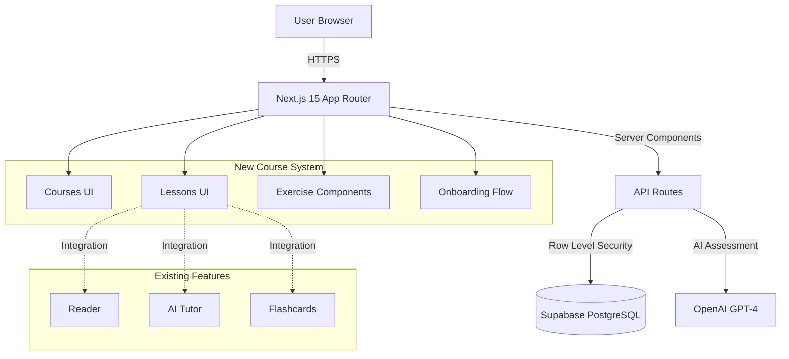
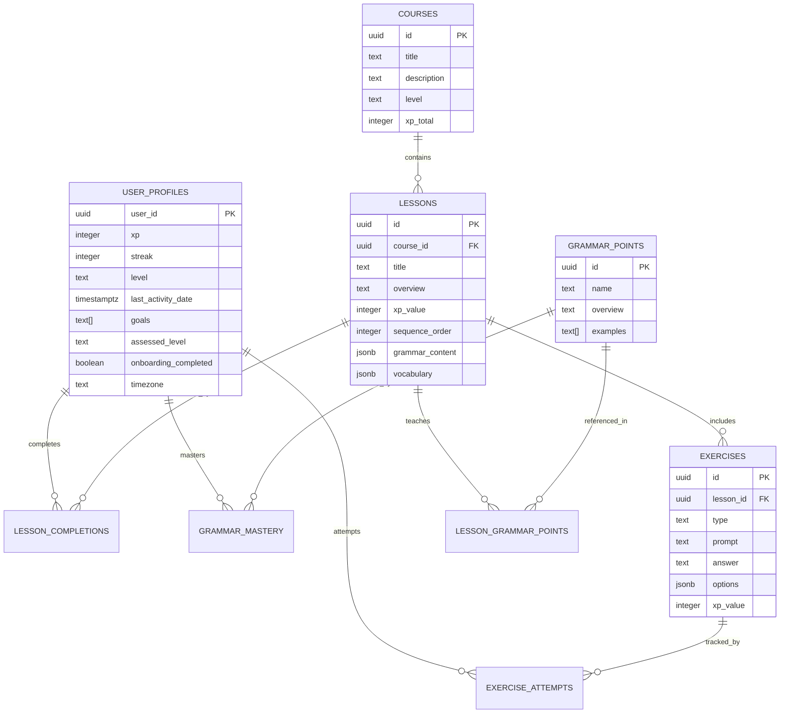
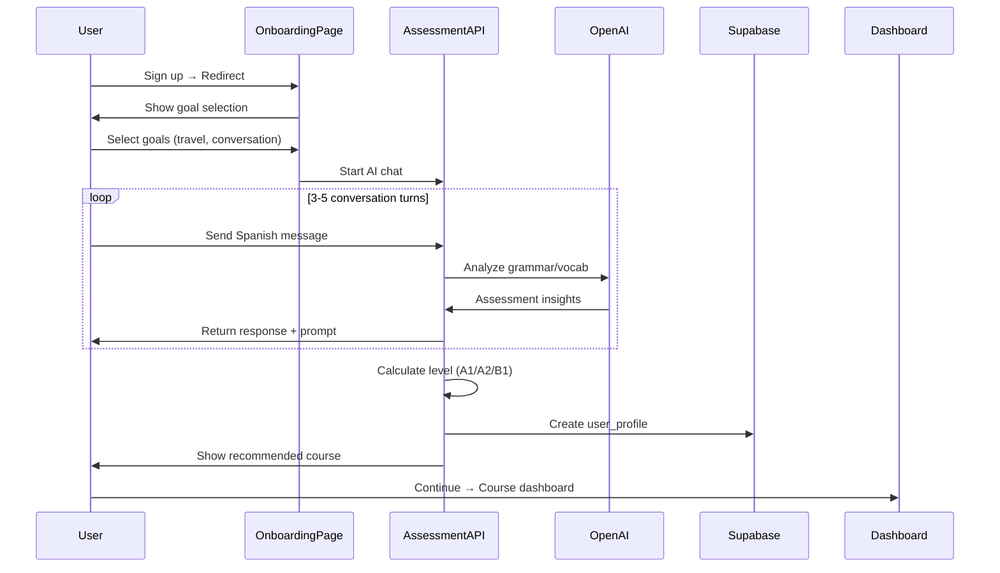
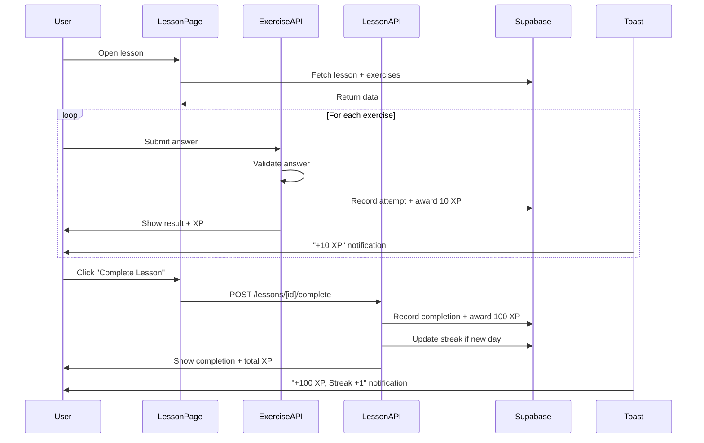
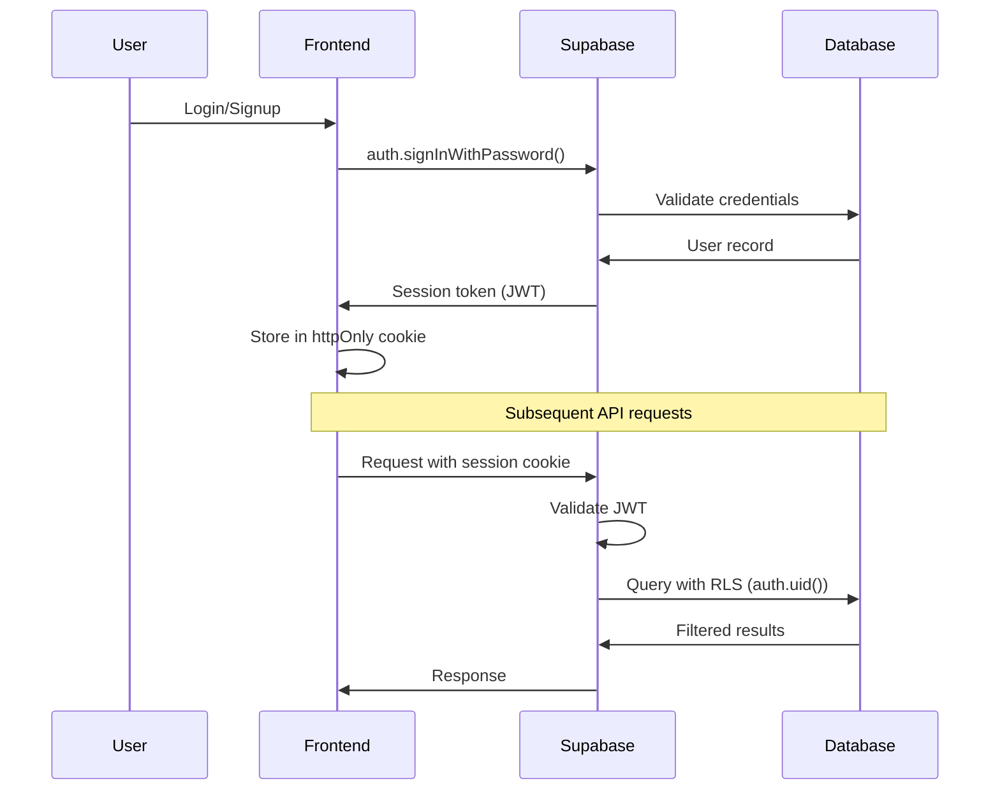

# Interlinear Course & Gamification System - Architecture v2

**Version:** 2.0
**Date:** 2025-11-02
**Status:** Ready for Implementation
**Based on PRD:** `docs/prd/course-gamification-system.md`

---

## Change Log

| Date | Version | Description | Author |
|------|---------|-------------|---------|
| 2025-11-02 | 2.0 | Initial architecture for course system with architectural decisions | Winston (Architect) |

---

## Introduction

This architecture document defines the technical implementation for adding structured courses, AI-powered onboarding, gamification, and interactive exercises to the existing Interlinear language learning platform. It builds upon the established Next.js 15 + Supabase foundation while introducing new data models, API patterns, and frontend experiences.

**Architectural Approach:** Extend existing patterns rather than rebuild. Reuse tutor infrastructure for onboarding, flashcard system for vocabulary integration, and UI components for consistency.

---

## High Level Architecture

### Technical Summary

The Course & Gamification System extends Interlinear's existing Next.js 15 App Router application with structured learning paths backed by Supabase PostgreSQL. The architecture introduces 9 new database tables for courses, lessons, exercises, and user progress while reusing the existing AI tutor infrastructure for onboarding assessment. Server-side validation via Next.js API routes ensures exercise integrity, while client-side React components deliver interactive learning experiences. User timezone handling is implemented at the profile level to support accurate streak tracking across global learners.

**Key Integration Points:**
- Onboarding AI chat → Reuses `/app/tutor/` DialogView component with modified system prompt
- Exercise validation → Server-side API routes prevent client-side answer tampering
- Flashcard generation → Auto-creates cards from lesson vocabulary via existing flashcard API
- Gamification backend → Hybrid XP awards (partial on exercises, bulk on lesson completion)

### Platform and Infrastructure Choice

**Platform:** Google Cloud Run (existing)
**Key Services:**
- **Hosting:** Google Cloud Run (containerized Next.js app)
- **Database:** Supabase PostgreSQL 15.x (managed)
- **Authentication:** Supabase Auth (PKCE flow)
- **AI:** OpenAI GPT-4 (existing integration)
- **IaC:** OpenTofu 1.8.x
- **CI/CD:** GitHub Actions

**Deployment Host and Regions:** Google Cloud Run (us-central1 staging + production)

### Repository Structure

**Structure:** Single repository (monorepo-lite via npm workspaces)
**Monorepo Tool:** npm workspaces (lightweight, no additional tooling needed)
**Package Organization:**
- `/app` - Next.js App Router pages and API routes
- `/components` - Shared React components
- `/lib` - Shared utilities and services
- `/types` - Shared TypeScript types
- `/supabase/migrations` - Database migrations

### High Level Architecture Diagram



### Architectural Patterns

- **Next.js App Router with Server Components:** Optimal performance with server-side rendering and streaming - _Rationale:_ Leverages Next.js 15 RSC for data fetching efficiency and SEO
- **Row-Level Security (RLS) Enforcement:** All database access filtered by `auth.uid()` - _Rationale:_ Security-by-default, prevents unauthorized data access
- **Hybrid XP Award Pattern:** Partial XP on exercises (immediate feedback) + bulk XP on lesson completion (milestone reward) - _Rationale:_ Balances instant gratification with achievement satisfaction
- **Server-Side Exercise Validation:** API routes validate answers and award XP - _Rationale:_ Prevents client-side tampering while enabling analytics
- **Component Reuse for Onboarding:** Existing `DialogView` tutor component with modified system prompt - _Rationale:_ Minimize new code, proven chat interface
- **YAML-Based Content Authoring:** Lessons authored in YAML + Markdown, parsed to database - _Rationale:_ Developer-friendly content workflow, version control friendly

---

## Architectural Decisions

### Decision Log

| Decision | Choice | Rationale |
|----------|--------|-----------|
| **Vocabulary Table Name** | Keep existing `vocabulary` table name | Existing migrations use `vocabulary`, PRD reference to `vocabulary_entries` was incorrect - minimal impact to update docs vs migrate data |
| **Onboarding Redirect Strategy** | Option A: `middleware.ts` checks `user_profiles.onboarding_completed` | Cleaner separation of concerns, scales to other auth-gated flows, centralized routing logic |
| **Exercise Validation Location** | Option B: Server-side API routes (`/api/exercises/[id]/validate`) | Security (prevent answer tampering), enables analytics tracking, consistent with existing API patterns |
| **XP Award Timing** | Hybrid: Partial (10 XP) on exercise completion + Bulk (100 XP) on lesson completion | Immediate feedback dopamine hit + milestone achievement satisfaction |
| **Streak Calculation** | UTC midnight with `last_activity_date` TIMESTAMPTZ in user profile | Timezone-aware via user profile setting, consistent across global users, prevents timezone gaming |
| **Timezone Handling** | Store user timezone in `user_profiles.timezone` field (IANA timezone string) | Essential for accurate streak tracking, daily quest resets, and activity analytics - integrated with onboarding flow |

---

## Tech Stack

| Category | Technology | Version | Purpose | Rationale |
|----------|------------|---------|---------|-----------|
| Frontend Language | TypeScript | 5.7.x | Type-safe development | Existing, strict mode enforced |
| Frontend Framework | Next.js (App Router) | 15.1.8 | React framework | Existing, RSC-enabled |
| UI Component Library | Custom components | - | Tailwind-styled components | Existing pattern, no MUI/shadcn |
| State Management | React Context + Hooks | 19.0.0 | Client state | Existing pattern, sufficient for scope |
| Backend Language | TypeScript | 5.7.x | API routes | Existing |
| Backend Framework | Next.js API Routes | 15.1.8 | REST API | Existing |
| API Style | REST | - | API endpoints | Existing pattern |
| Database | PostgreSQL | 15.x | Supabase managed | Existing |
| Cache | In-memory Map | - | Server-side caching | Existing for dictionary/TTS |
| File Storage | Supabase Storage | - | Asset storage | Available if needed for lesson media |
| Authentication | Supabase Auth | - | PKCE flow | Existing |
| Frontend Testing | Vitest + React Testing Library | - | Component tests | Existing |
| Backend Testing | Vitest | - | API route tests | Existing |
| E2E Testing | Playwright | - | End-to-end tests | Existing |
| Build Tool | npm | 10.x | Package management | Existing |
| Bundler | Turbopack | - | Next.js built-in | Existing |
| IaC Tool | OpenTofu | 1.8.x | Infrastructure as Code | Existing |
| CI/CD | GitHub Actions | - | Automated deployment | Existing |
| Monitoring | Google Cloud Logging | - | GCP native | Existing |
| Logging | Google Cloud Logging | - | GCP native | Existing |
| CSS Framework | Tailwind CSS | 3.4.x | Utility-first styling | Existing |
| AI Integration | OpenAI GPT-4 | - | Onboarding assessment & tutor | Existing |

---

## Data Models

### Core Entities Overview



### TypeScript Interfaces

#### User Profile
```typescript
interface UserProfile {
  user_id: string; // References auth.users(id)
  xp: number;
  streak: number;
  level: 'A1' | 'A2' | 'B1' | 'B2' | 'C1' | 'C2';
  last_activity_date: string; // ISO 8601 timestamp
  goals: ('travel' | 'work' | 'heritage' | 'conversation' | 'academic')[];
  assessed_level: 'A1' | 'A2' | 'B1' | null;
  onboarding_completed: boolean;
  timezone: string; // IANA timezone (e.g., 'America/New_York')
  created_at: string;
  updated_at: string;
}
```

#### Course
```typescript
interface Course {
  id: string;
  title: string;
  description: string;
  level: 'A1' | 'A2' | 'B1' | 'B2' | 'C1' | 'C2';
  xp_total: number; // Sum of all lesson XP values
  created_at: string;
  updated_at: string;
}
```

#### Lesson
```typescript
interface Lesson {
  id: string;
  course_id: string;
  title: string;
  overview: string; // Brief description
  xp_value: number; // Default: 100
  sequence_order: number; // 1, 2, 3... for ordering
  grammar_content: {
    markdown: string; // Rendered lesson content
  };
  vocabulary: {
    word: string;
    translation: string;
    example?: string;
  }[];
  created_at: string;
  updated_at: string;
}
```

#### Grammar Point
```typescript
interface GrammarPoint {
  id: string;
  name: string; // e.g., "El verbo SER (presente)"
  overview: string; // Brief explanation
  examples: string[]; // ["Yo soy estudiante", "Ella es de México"]
  created_at: string;
}
```

#### Exercise
```typescript
interface Exercise {
  id: string;
  lesson_id: string;
  type: 'fill_blank' | 'multiple_choice' | 'translation';
  prompt: string; // Question text
  answer: string; // Correct answer
  options?: string[]; // For multiple choice
  xp_value: number; // Default: 10
  created_at: string;
}
```

#### Lesson Completion
```typescript
interface LessonCompletion {
  id: string;
  user_id: string;
  lesson_id: string;
  xp_earned: number;
  completed_at: string;
}
```

#### Exercise Attempt
```typescript
interface ExerciseAttempt {
  id: string;
  user_id: string;
  exercise_id: string;
  user_answer: string;
  is_correct: boolean;
  xp_earned: number;
  attempted_at: string;
}
```

#### Grammar Mastery
```typescript
interface GrammarMastery {
  id: string;
  user_id: string;
  grammar_point_id: string;
  confidence: number; // 0-100 score based on exercise performance
  last_practiced: string;
}
```

---

## Database Schema

### Complete SQL Schema

```sql
-- =============================================================================
-- USER PROFILES TABLE
-- =============================================================================
CREATE TABLE IF NOT EXISTS public.user_profiles (
  user_id UUID PRIMARY KEY REFERENCES auth.users(id) ON DELETE CASCADE,
  xp INTEGER NOT NULL DEFAULT 0,
  streak INTEGER NOT NULL DEFAULT 0,
  level TEXT NOT NULL DEFAULT 'A1' CHECK (level IN ('A1', 'A2', 'B1', 'B2', 'C1', 'C2')),
  last_activity_date TIMESTAMPTZ,
  goals TEXT[] DEFAULT '{}', -- ['travel', 'conversation', etc.]
  assessed_level TEXT CHECK (assessed_level IN ('A1', 'A2', 'B1', 'B2', 'C1', 'C2')),
  onboarding_completed BOOLEAN NOT NULL DEFAULT FALSE,
  timezone TEXT NOT NULL DEFAULT 'UTC', -- IANA timezone string (e.g., 'America/New_York')
  created_at TIMESTAMPTZ NOT NULL DEFAULT NOW(),
  updated_at TIMESTAMPTZ NOT NULL DEFAULT NOW()
);

-- =============================================================================
-- COURSES TABLE
-- =============================================================================
CREATE TABLE IF NOT EXISTS public.courses (
  id UUID PRIMARY KEY DEFAULT gen_random_uuid(),
  title TEXT NOT NULL,
  description TEXT NOT NULL,
  level TEXT NOT NULL CHECK (level IN ('A1', 'A2', 'B1', 'B2', 'C1', 'C2')),
  xp_total INTEGER NOT NULL DEFAULT 0,
  created_at TIMESTAMPTZ NOT NULL DEFAULT NOW(),
  updated_at TIMESTAMPTZ NOT NULL DEFAULT NOW()
);

-- =============================================================================
-- LESSONS TABLE
-- =============================================================================
CREATE TABLE IF NOT EXISTS public.lessons (
  id UUID PRIMARY KEY DEFAULT gen_random_uuid(),
  course_id UUID NOT NULL REFERENCES public.courses(id) ON DELETE CASCADE,
  title TEXT NOT NULL,
  overview TEXT NOT NULL,
  xp_value INTEGER NOT NULL DEFAULT 100,
  sequence_order INTEGER NOT NULL,
  grammar_content JSONB NOT NULL DEFAULT '{"markdown": ""}',
  vocabulary JSONB NOT NULL DEFAULT '[]', -- Array of {word, translation, example}
  created_at TIMESTAMPTZ NOT NULL DEFAULT NOW(),
  updated_at TIMESTAMPTZ NOT NULL DEFAULT NOW(),

  -- Ensure unique ordering within course
  UNIQUE(course_id, sequence_order)
);

-- =============================================================================
-- GRAMMAR POINTS TABLE
-- =============================================================================
CREATE TABLE IF NOT EXISTS public.grammar_points (
  id UUID PRIMARY KEY DEFAULT gen_random_uuid(),
  name TEXT NOT NULL UNIQUE,
  overview TEXT NOT NULL,
  examples TEXT[] NOT NULL DEFAULT '{}',
  created_at TIMESTAMPTZ NOT NULL DEFAULT NOW()
);

-- =============================================================================
-- LESSON GRAMMAR POINTS (JUNCTION TABLE)
-- =============================================================================
CREATE TABLE IF NOT EXISTS public.lesson_grammar_points (
  lesson_id UUID NOT NULL REFERENCES public.lessons(id) ON DELETE CASCADE,
  grammar_point_id UUID NOT NULL REFERENCES public.grammar_points(id) ON DELETE CASCADE,
  PRIMARY KEY (lesson_id, grammar_point_id)
);

-- =============================================================================
-- EXERCISES TABLE
-- =============================================================================
CREATE TABLE IF NOT EXISTS public.exercises (
  id UUID PRIMARY KEY DEFAULT gen_random_uuid(),
  lesson_id UUID NOT NULL REFERENCES public.lessons(id) ON DELETE CASCADE,
  type TEXT NOT NULL CHECK (type IN ('fill_blank', 'multiple_choice', 'translation')),
  prompt TEXT NOT NULL,
  answer TEXT NOT NULL,
  options JSONB, -- Array of strings for multiple choice
  xp_value INTEGER NOT NULL DEFAULT 10,
  created_at TIMESTAMPTZ NOT NULL DEFAULT NOW()
);

-- =============================================================================
-- LESSON COMPLETIONS TABLE
-- =============================================================================
CREATE TABLE IF NOT EXISTS public.lesson_completions (
  id UUID PRIMARY KEY DEFAULT gen_random_uuid(),
  user_id UUID NOT NULL REFERENCES auth.users(id) ON DELETE CASCADE,
  lesson_id UUID NOT NULL REFERENCES public.lessons(id) ON DELETE CASCADE,
  xp_earned INTEGER NOT NULL,
  completed_at TIMESTAMPTZ NOT NULL DEFAULT NOW(),

  -- User can only complete a lesson once
  UNIQUE(user_id, lesson_id)
);

-- =============================================================================
-- EXERCISE ATTEMPTS TABLE
-- =============================================================================
CREATE TABLE IF NOT EXISTS public.exercise_attempts (
  id UUID PRIMARY KEY DEFAULT gen_random_uuid(),
  user_id UUID NOT NULL REFERENCES auth.users(id) ON DELETE CASCADE,
  exercise_id UUID NOT NULL REFERENCES public.exercises(id) ON DELETE CASCADE,
  user_answer TEXT NOT NULL,
  is_correct BOOLEAN NOT NULL,
  xp_earned INTEGER NOT NULL DEFAULT 0,
  attempted_at TIMESTAMPTZ NOT NULL DEFAULT NOW()
);

-- =============================================================================
-- GRAMMAR MASTERY TABLE
-- =============================================================================
CREATE TABLE IF NOT EXISTS public.grammar_mastery (
  id UUID PRIMARY KEY DEFAULT gen_random_uuid(),
  user_id UUID NOT NULL REFERENCES auth.users(id) ON DELETE CASCADE,
  grammar_point_id UUID NOT NULL REFERENCES public.grammar_points(id) ON DELETE CASCADE,
  confidence INTEGER NOT NULL DEFAULT 0 CHECK (confidence >= 0 AND confidence <= 100),
  last_practiced TIMESTAMPTZ NOT NULL DEFAULT NOW(),

  -- One mastery record per user per grammar point
  UNIQUE(user_id, grammar_point_id)
);

-- =============================================================================
-- INDEXES FOR PERFORMANCE
-- =============================================================================
CREATE INDEX idx_user_profiles_user_id ON public.user_profiles(user_id);
CREATE INDEX idx_courses_level ON public.courses(level);
CREATE INDEX idx_lessons_course_id ON public.lessons(course_id);
CREATE INDEX idx_lessons_sequence ON public.lessons(course_id, sequence_order);
CREATE INDEX idx_exercises_lesson_id ON public.exercises(lesson_id);
CREATE INDEX idx_lesson_completions_user_id ON public.lesson_completions(user_id);
CREATE INDEX idx_lesson_completions_lesson_id ON public.lesson_completions(lesson_id);
CREATE INDEX idx_exercise_attempts_user_id ON public.exercise_attempts(user_id);
CREATE INDEX idx_exercise_attempts_exercise_id ON public.exercise_attempts(exercise_id);
CREATE INDEX idx_grammar_mastery_user_id ON public.grammar_mastery(user_id);

-- =============================================================================
-- ROW LEVEL SECURITY POLICIES
-- =============================================================================

-- User Profiles: Users can only access their own profile
ALTER TABLE public.user_profiles ENABLE ROW LEVEL SECURITY;

CREATE POLICY "Users can view own profile"
  ON public.user_profiles FOR SELECT
  TO authenticated
  USING (auth.uid() = user_id);

CREATE POLICY "Users can insert own profile"
  ON public.user_profiles FOR INSERT
  TO authenticated
  WITH CHECK (auth.uid() = user_id);

CREATE POLICY "Users can update own profile"
  ON public.user_profiles FOR UPDATE
  TO authenticated
  USING (auth.uid() = user_id);

-- Courses: Public read, admin write
ALTER TABLE public.courses ENABLE ROW LEVEL SECURITY;

CREATE POLICY "Anyone can view courses"
  ON public.courses FOR SELECT
  TO authenticated
  USING (true);

-- Lessons: Public read, admin write
ALTER TABLE public.lessons ENABLE ROW LEVEL SECURITY;

CREATE POLICY "Anyone can view lessons"
  ON public.lessons FOR SELECT
  TO authenticated
  USING (true);

-- Grammar Points: Public read, admin write
ALTER TABLE public.grammar_points ENABLE ROW LEVEL SECURITY;

CREATE POLICY "Anyone can view grammar points"
  ON public.grammar_points FOR SELECT
  TO authenticated
  USING (true);

-- Lesson Grammar Points: Public read, admin write
ALTER TABLE public.lesson_grammar_points ENABLE ROW LEVEL SECURITY;

CREATE POLICY "Anyone can view lesson grammar points"
  ON public.lesson_grammar_points FOR SELECT
  TO authenticated
  USING (true);

-- Exercises: Public read, admin write
ALTER TABLE public.exercises ENABLE ROW LEVEL SECURITY;

CREATE POLICY "Anyone can view exercises"
  ON public.exercises FOR SELECT
  TO authenticated
  USING (true);

-- Lesson Completions: Users can only access their own completions
ALTER TABLE public.lesson_completions ENABLE ROW LEVEL SECURITY;

CREATE POLICY "Users can view own completions"
  ON public.lesson_completions FOR SELECT
  TO authenticated
  USING (auth.uid() = user_id);

CREATE POLICY "Users can insert own completions"
  ON public.lesson_completions FOR INSERT
  TO authenticated
  WITH CHECK (auth.uid() = user_id);

-- Exercise Attempts: Users can only access their own attempts
ALTER TABLE public.exercise_attempts ENABLE ROW LEVEL SECURITY;

CREATE POLICY "Users can view own attempts"
  ON public.exercise_attempts FOR SELECT
  TO authenticated
  USING (auth.uid() = user_id);

CREATE POLICY "Users can insert own attempts"
  ON public.exercise_attempts FOR INSERT
  TO authenticated
  WITH CHECK (auth.uid() = user_id);

-- Grammar Mastery: Users can only access their own mastery data
ALTER TABLE public.grammar_mastery ENABLE ROW LEVEL SECURITY;

CREATE POLICY "Users can view own mastery"
  ON public.grammar_mastery FOR SELECT
  TO authenticated
  USING (auth.uid() = user_id);

CREATE POLICY "Users can insert own mastery"
  ON public.grammar_mastery FOR INSERT
  TO authenticated
  WITH CHECK (auth.uid() = user_id);

CREATE POLICY "Users can update own mastery"
  ON public.grammar_mastery FOR UPDATE
  TO authenticated
  USING (auth.uid() = user_id);

-- =============================================================================
-- FUNCTIONS AND TRIGGERS
-- =============================================================================

-- Update updated_at timestamp automatically
CREATE OR REPLACE FUNCTION update_updated_at_column()
RETURNS TRIGGER AS $$
BEGIN
  NEW.updated_at = NOW();
  RETURN NEW;
END;
$$ LANGUAGE plpgsql;

CREATE TRIGGER update_user_profiles_updated_at
  BEFORE UPDATE ON public.user_profiles
  FOR EACH ROW
  EXECUTE FUNCTION update_updated_at_column();

CREATE TRIGGER update_courses_updated_at
  BEFORE UPDATE ON public.courses
  FOR EACH ROW
  EXECUTE FUNCTION update_updated_at_column();

CREATE TRIGGER update_lessons_updated_at
  BEFORE UPDATE ON public.lessons
  FOR EACH ROW
  EXECUTE FUNCTION update_updated_at_column();
```

---

## API Specification

### REST API Endpoints

#### Onboarding

**POST `/api/onboarding/assess`**
- **Purpose:** Assess user level based on AI conversation
- **Request Body:**
  ```typescript
  {
    conversation: Array<{role: 'user' | 'assistant', content: string}>;
    goals: ('travel' | 'work' | 'heritage' | 'conversation' | 'academic')[];
    timezone: string; // IANA timezone from browser
  }
  ```
- **Response:**
  ```typescript
  {
    assessed_level: 'A1' | 'A2' | 'B1';
    recommended_course_id: string;
  }
  ```

**POST `/api/onboarding/complete`**
- **Purpose:** Create user profile and mark onboarding complete
- **Request Body:**
  ```typescript
  {
    assessed_level: string;
    goals: string[];
    timezone: string;
  }
  ```
- **Response:**
  ```typescript
  {
    user_profile: UserProfile;
  }
  ```

#### Courses

**GET `/api/courses`**
- **Purpose:** List all courses
- **Response:**
  ```typescript
  {
    courses: Course[];
  }
  ```

**GET `/api/courses/[id]`**
- **Purpose:** Get course details with lessons
- **Response:**
  ```typescript
  {
    course: Course;
    lessons: Lesson[];
    user_progress?: {
      completed_lessons: string[]; // lesson IDs
      total_xp: number;
    };
  }
  ```

#### Lessons

**GET `/api/lessons/[id]`**
- **Purpose:** Get lesson details with exercises
- **Response:**
  ```typescript
  {
    lesson: Lesson;
    grammar_points: GrammarPoint[];
    exercises: Exercise[];
    is_completed: boolean;
  }
  ```

**POST `/api/lessons/[id]/complete`**
- **Purpose:** Mark lesson complete and award bulk XP
- **Request Body:**
  ```typescript
  {}
  ```
- **Response:**
  ```typescript
  {
    xp_earned: number;
    new_total_xp: number;
    new_streak: number;
    completion: LessonCompletion;
  }
  ```

#### Exercises

**POST `/api/exercises/[id]/validate`**
- **Purpose:** Validate exercise answer and award partial XP
- **Request Body:**
  ```typescript
  {
    user_answer: string;
  }
  ```
- **Response:**
  ```typescript
  {
    is_correct: boolean;
    correct_answer?: string; // Only if incorrect
    xp_earned: number;
    new_total_xp: number;
    attempt: ExerciseAttempt;
  }
  ```

#### User Profile

**GET `/api/profile`**
- **Purpose:** Get current user profile
- **Response:**
  ```typescript
  {
    profile: UserProfile;
  }
  ```

**PATCH `/api/profile`**
- **Purpose:** Update user profile (goals, timezone)
- **Request Body:**
  ```typescript
  {
    goals?: string[];
    timezone?: string;
  }
  ```
- **Response:**
  ```typescript
  {
    profile: UserProfile;
  }
  ```

---

## Components

### Component Hierarchy

```
app/
├── onboarding/
│   ├── page.tsx                    # Welcome + goal selection
│   └── chat/
│       └── page.tsx               # AI assessment chat (reuses DialogView)
├── dashboard/
│   └── page.tsx                    # Course overview + XP/streak widgets
├── courses/
│   ├── page.tsx                    # Course list
│   └── [id]/
│       └── page.tsx               # Lesson list for course
└── lessons/
    └── [id]/
        └── page.tsx               # Lesson viewer + exercises

components/
├── courses/
│   ├── CourseCard.tsx             # Course preview card
│   ├── LessonCard.tsx             # Lesson preview card
│   └── ProgressBar.tsx            # Course completion progress
├── lessons/
│   ├── LessonContent.tsx          # Markdown + grammar + vocab
│   ├── GrammarSection.tsx         # Grammar point display
│   ├── VocabularySection.tsx      # Vocab list
│   └── ExerciseList.tsx           # Exercise container
├── exercises/
│   ├── FillBlankExercise.tsx      # Fill-in-blank component
│   ├── MultipleChoiceExercise.tsx # Multiple choice component
│   └── ExerciseResult.tsx         # Feedback display
├── gamification/
│   ├── XPDisplay.tsx              # XP bar widget
│   ├── StreakDisplay.tsx          # Streak counter widget
│   └── XPToast.tsx                # XP award notification
└── onboarding/
    ├── GoalSelector.tsx           # Goal selection UI
    └── AssessmentChat.tsx         # Wrapper for DialogView
```

### Key Component Descriptions

**CourseCard**
- **Responsibility:** Display course preview with metadata
- **Key Interfaces:**
  - Props: `{course: Course, userProgress?: {completed_lessons: number, total_lessons: number}}`
  - Events: `onClick` → navigate to `/courses/[id]`
- **Dependencies:** `ProgressBar`, `components/ui/card`
- **Technology Stack:** React Server Component, Tailwind CSS

**LessonContent**
- **Responsibility:** Render lesson Markdown + grammar + vocabulary
- **Key Interfaces:**
  - Props: `{lesson: Lesson, grammarPoints: GrammarPoint[]}`
  - Renders: Markdown content, grammar sections, vocab list
- **Dependencies:** `marked` (Markdown parser), `GrammarSection`, `VocabularySection`
- **Technology Stack:** Client Component, Tailwind CSS

**FillBlankExercise**
- **Responsibility:** Interactive fill-in-blank exercise with validation
- **Key Interfaces:**
  - Props: `{exercise: Exercise, onSubmit: (answer: string) => Promise<{is_correct: boolean}>}`
  - State: `userAnswer: string`, `result: {is_correct, correct_answer?}`
- **Dependencies:** `/api/exercises/[id]/validate`
- **Technology Stack:** Client Component, Tailwind CSS, form validation

**XPDisplay**
- **Responsibility:** Animated XP bar with level progress
- **Key Interfaces:**
  - Props: `{xp: number, level: string}`
  - Updates: Real-time on XP awards
- **Dependencies:** React Context for XP state
- **Technology Stack:** Client Component, Tailwind CSS, CSS animations

---

## External APIs

### OpenAI API

- **Purpose:** AI-powered onboarding assessment
- **Documentation:** https://platform.openai.com/docs/api-reference
- **Base URL(s):** `https://api.openai.com/v1`
- **Authentication:** Bearer token (API key)
- **Rate Limits:** 10,000 requests/min (tier 4)

**Key Endpoints Used:**
- `POST /chat/completions` - Conversational AI for onboarding assessment

**Integration Notes:** Reuse existing OpenAI integration from `/lib/tutor-tools.ts`. Modify system prompt for onboarding context to assess grammar complexity, vocabulary range, and response coherence.

---

## Core Workflows

### Onboarding Flow



### Lesson Completion Flow



---

## Frontend Architecture

### Component Organization

```
components/
├── ui/                    # Base UI primitives (existing)
│   ├── button.tsx
│   ├── card.tsx
│   ├── dialog.tsx
│   ├── input.tsx
│   ├── tabs.tsx
│   └── progress.tsx
├── courses/              # Course-specific components (NEW)
│   ├── CourseCard.tsx
│   ├── LessonCard.tsx
│   └── ProgressBar.tsx
├── lessons/              # Lesson-specific components (NEW)
│   ├── LessonContent.tsx
│   ├── GrammarSection.tsx
│   ├── VocabularySection.tsx
│   └── ExerciseList.tsx
├── exercises/            # Exercise components (NEW)
│   ├── FillBlankExercise.tsx
│   ├── MultipleChoiceExercise.tsx
│   └── ExerciseResult.tsx
├── gamification/         # Gamification widgets (NEW)
│   ├── XPDisplay.tsx
│   ├── StreakDisplay.tsx
│   └── XPToast.tsx
└── onboarding/           # Onboarding components (NEW)
    ├── GoalSelector.tsx
    └── AssessmentChat.tsx
```

### State Management Architecture

**Approach:** React Context + Hooks for client state

**Global State:**
- `UserProfileContext` - XP, streak, level, timezone
- `ToastContext` - XP award notifications

**Local State:**
- Component-level state for forms, exercise inputs
- Server Components fetch data directly (no client state)

**State Update Pattern:**
```typescript
// After XP award
const { updateXP } = useUserProfile();
const response = await fetch('/api/exercises/123/validate', {...});
const { xp_earned, new_total_xp } = await response.json();
updateXP(new_total_xp); // Triggers context update
showToast(`+${xp_earned} XP`); // Triggers toast notification
```

### Routing Architecture

**Next.js 15 App Router Structure:**

```
app/
├── layout.tsx                      # Root layout (auth wrapper)
├── page.tsx                        # Landing page (redirect if auth)
├── onboarding/
│   ├── page.tsx                   # Welcome + goal selection
│   └── chat/
│       └── page.tsx               # AI assessment chat
├── dashboard/
│   └── page.tsx                   # Course overview (protected)
├── courses/
│   ├── page.tsx                   # Course list (protected)
│   └── [id]/
│       └── page.tsx               # Lesson list (protected)
├── lessons/
│   └── [id]/
│       └── page.tsx               # Lesson viewer (protected)
└── api/
    ├── onboarding/
    │   ├── assess/route.ts
    │   └── complete/route.ts
    ├── courses/
    │   ├── route.ts
    │   └── [id]/route.ts
    ├── lessons/
    │   ├── [id]/route.ts
    │   └── [id]/complete/route.ts
    └── exercises/
        └── [id]/validate/route.ts
```

**Protected Route Pattern:**

```typescript
// middleware.ts (UPDATED)
import { createServerClient } from '@supabase/ssr';

export async function middleware(request: NextRequest) {
  const supabase = createServerClient(...);
  const { data: { session } } = await supabase.auth.getSession();

  if (!session && request.nextUrl.pathname.startsWith('/dashboard')) {
    return NextResponse.redirect(new URL('/login', request.url));
  }

  // NEW: Check onboarding completion
  if (session && !request.nextUrl.pathname.startsWith('/onboarding')) {
    const { data: profile } = await supabase
      .from('user_profiles')
      .select('onboarding_completed')
      .eq('user_id', session.user.id)
      .single();

    if (!profile?.onboarding_completed) {
      return NextResponse.redirect(new URL('/onboarding', request.url));
    }
  }

  return NextResponse.next();
}
```

### Frontend Services Layer

**API Client Setup:**

```typescript
// lib/services/courses.ts (NEW)
import { createClient } from '@/lib/supabase/client';

export async function getCourses() {
  const supabase = createClient();
  const { data, error } = await supabase
    .from('courses')
    .select('*')
    .order('level');

  if (error) throw error;
  return data;
}

export async function getCourseWithLessons(courseId: string) {
  const supabase = createClient();
  const { data, error } = await supabase
    .from('courses')
    .select(`
      *,
      lessons (*)
    `)
    .eq('id', courseId)
    .single();

  if (error) throw error;
  return data;
}
```

**Service Example:**

```typescript
// lib/services/exercises.ts (NEW)
export async function validateExercise(
  exerciseId: string,
  userAnswer: string
): Promise<{is_correct: boolean; correct_answer?: string; xp_earned: number}> {
  const response = await fetch(`/api/exercises/${exerciseId}/validate`, {
    method: 'POST',
    headers: {'Content-Type': 'application/json'},
    body: JSON.stringify({ user_answer: userAnswer }),
  });

  if (!response.ok) {
    throw new Error('Validation failed');
  }

  return response.json();
}
```

---

## Backend Architecture

### Service Architecture (Next.js API Routes)

**Function Organization:**

```
app/api/
├── onboarding/
│   ├── assess/
│   │   └── route.ts           # POST - AI assessment logic
│   └── complete/
│       └── route.ts           # POST - Profile creation
├── courses/
│   ├── route.ts               # GET - List courses
│   └── [id]/
│       └── route.ts           # GET - Course + lessons
├── lessons/
│   ├── [id]/
│   │   ├── route.ts           # GET - Lesson details
│   │   └── complete/
│   │       └── route.ts       # POST - Mark complete
└── exercises/
    └── [id]/
        └── validate/
            └── route.ts        # POST - Validate answer
```

**Route Template:**

```typescript
// app/api/exercises/[id]/validate/route.ts
import { createClient } from '@/lib/supabase/server';
import { NextRequest, NextResponse } from 'next/server';

export async function POST(
  request: NextRequest,
  { params }: { params: { id: string } }
) {
  const supabase = createClient();

  // 1. Authenticate user
  const { data: { session } } = await supabase.auth.getSession();
  if (!session) {
    return NextResponse.json({ error: 'Unauthorized' }, { status: 401 });
  }

  // 2. Parse request
  const { user_answer } = await request.json();

  // 3. Fetch exercise
  const { data: exercise, error: exerciseError } = await supabase
    .from('exercises')
    .select('answer, xp_value')
    .eq('id', params.id)
    .single();

  if (exerciseError) {
    return NextResponse.json({ error: 'Exercise not found' }, { status: 404 });
  }

  // 4. Validate answer
  const is_correct = user_answer.trim().toLowerCase() === exercise.answer.trim().toLowerCase();
  const xp_earned = is_correct ? exercise.xp_value : 0;

  // 5. Record attempt
  const { error: attemptError } = await supabase
    .from('exercise_attempts')
    .insert({
      user_id: session.user.id,
      exercise_id: params.id,
      user_answer,
      is_correct,
      xp_earned,
    });

  if (attemptError) {
    return NextResponse.json({ error: 'Failed to record attempt' }, { status: 500 });
  }

  // 6. Update user XP
  const { data: profile, error: profileError } = await supabase
    .from('user_profiles')
    .select('xp')
    .eq('user_id', session.user.id)
    .single();

  const new_total_xp = (profile?.xp || 0) + xp_earned;

  await supabase
    .from('user_profiles')
    .update({ xp: new_total_xp })
    .eq('user_id', session.user.id);

  // 7. Return result
  return NextResponse.json({
    is_correct,
    correct_answer: is_correct ? undefined : exercise.answer,
    xp_earned,
    new_total_xp,
  });
}
```

### Database Architecture

**Data Access Layer (Repository Pattern):**

```typescript
// lib/repositories/lessons.ts (NEW)
import { createClient } from '@/lib/supabase/server';

export async function getLessonById(lessonId: string) {
  const supabase = createClient();
  const { data, error } = await supabase
    .from('lessons')
    .select(`
      *,
      course:courses (*),
      exercises (*),
      lesson_grammar_points (
        grammar_point:grammar_points (*)
      )
    `)
    .eq('id', lessonId)
    .single();

  if (error) throw error;
  return data;
}

export async function markLessonComplete(userId: string, lessonId: string) {
  const supabase = createClient();

  // Check if already completed
  const { data: existing } = await supabase
    .from('lesson_completions')
    .select('id')
    .eq('user_id', userId)
    .eq('lesson_id', lessonId)
    .single();

  if (existing) {
    throw new Error('Lesson already completed');
  }

  // Get lesson XP value
  const { data: lesson } = await supabase
    .from('lessons')
    .select('xp_value')
    .eq('id', lessonId)
    .single();

  // Record completion
  const { error } = await supabase
    .from('lesson_completions')
    .insert({
      user_id: userId,
      lesson_id: lessonId,
      xp_earned: lesson?.xp_value || 100,
    });

  if (error) throw error;

  // Update user XP
  const { data: profile } = await supabase
    .from('user_profiles')
    .select('xp')
    .eq('user_id', userId)
    .single();

  const new_xp = (profile?.xp || 0) + (lesson?.xp_value || 100);

  await supabase
    .from('user_profiles')
    .update({ xp: new_xp })
    .eq('user_id', userId);

  return { xp_earned: lesson?.xp_value || 100, new_total_xp: new_xp };
}
```

### Authentication and Authorization

**Auth Flow (Existing Supabase Auth):**



**Middleware/Guards:**

```typescript
// middleware.ts (UPDATED with onboarding check)
import { createServerClient } from '@supabase/ssr';
import { NextRequest, NextResponse } from 'next/server';

export async function middleware(request: NextRequest) {
  const supabase = createServerClient(...);
  const { data: { session } } = await supabase.auth.getSession();

  // Redirect unauthenticated users
  if (!session && request.nextUrl.pathname.startsWith('/dashboard')) {
    return NextResponse.redirect(new URL('/login', request.url));
  }

  // Check onboarding completion for authenticated users
  if (session && !request.nextUrl.pathname.startsWith('/onboarding')) {
    const { data: profile } = await supabase
      .from('user_profiles')
      .select('onboarding_completed')
      .eq('user_id', session.user.id)
      .single();

    if (!profile?.onboarding_completed) {
      return NextResponse.redirect(new URL('/onboarding', request.url));
    }
  }

  return NextResponse.next();
}

export const config = {
  matcher: ['/((?!_next/static|_next/image|favicon.ico).*)'],
};
```

---

## Unified Project Structure

```
interlinear/
├── .github/
│   └── workflows/
│       ├── ci.yml                  # Existing CI pipeline
│       └── deploy-staging.yml      # Existing deployment
├── app/                            # Next.js App Router
│   ├── layout.tsx                  # Root layout (existing)
│   ├── page.tsx                    # Landing page (UPDATED - redirect logic)
│   ├── globals.css                 # Global styles (existing)
│   ├── onboarding/                 # NEW
│   │   ├── page.tsx               # Welcome + goal selection
│   │   └── chat/
│   │       └── page.tsx           # AI assessment chat
│   ├── dashboard/                  # NEW
│   │   └── page.tsx               # Course overview
│   ├── courses/                    # NEW
│   │   ├── page.tsx               # Course list
│   │   └── [id]/
│   │       └── page.tsx           # Lesson list
│   ├── lessons/                    # NEW
│   │   └── [id]/
│   │       └── page.tsx           # Lesson viewer
│   ├── reader/                     # Existing
│   ├── tutor/                      # Existing
│   ├── flashcards/                 # Existing
│   ├── library/                    # Existing
│   ├── vocabulary/                 # Existing
│   └── api/
│       ├── onboarding/             # NEW
│       │   ├── assess/route.ts
│       │   └── complete/route.ts
│       ├── courses/                # NEW
│       │   ├── route.ts
│       │   └── [id]/route.ts
│       ├── lessons/                # NEW
│       │   └── [id]/
│       │       ├── route.ts
│       │       └── complete/route.ts
│       ├── exercises/              # NEW
│       │   └── [id]/
│       │       └── validate/route.ts
│       ├── profile/                # NEW
│       │   └── route.ts
│       ├── dictionary/             # Existing
│       ├── tutor/                  # Existing
│       ├── flashcards/             # Existing
│       └── tts/                    # Existing
├── components/
│   ├── ui/                         # Existing base components
│   ├── courses/                    # NEW
│   │   ├── CourseCard.tsx
│   │   ├── LessonCard.tsx
│   │   └── ProgressBar.tsx
│   ├── lessons/                    # NEW
│   │   ├── LessonContent.tsx
│   │   ├── GrammarSection.tsx
│   │   ├── VocabularySection.tsx
│   │   └── ExerciseList.tsx
│   ├── exercises/                  # NEW
│   │   ├── FillBlankExercise.tsx
│   │   ├── MultipleChoiceExercise.tsx
│   │   └── ExerciseResult.tsx
│   ├── gamification/               # NEW
│   │   ├── XPDisplay.tsx
│   │   ├── StreakDisplay.tsx
│   │   └── XPToast.tsx
│   ├── onboarding/                 # NEW
│   │   ├── GoalSelector.tsx
│   │   └── AssessmentChat.tsx
│   ├── reader/                     # Existing
│   ├── tutor/                      # Existing
│   └── Navigation.tsx              # Existing (UPDATED - add dashboard link)
├── lib/
│   ├── services/
│   │   ├── courses.ts              # NEW
│   │   ├── lessons.ts              # NEW
│   │   ├── exercises.ts            # NEW
│   │   ├── onboarding.ts           # NEW
│   │   ├── flashcards.ts           # Existing
│   │   └── library.ts              # Existing
│   ├── repositories/               # NEW
│   │   ├── lessons.ts
│   │   └── exercises.ts
│   ├── supabase/
│   │   ├── client.ts               # Existing
│   │   └── server.ts               # Existing
│   ├── utils/
│   │   ├── text.ts                 # Existing
│   │   └── timezone.ts             # NEW - timezone utilities
│   ├── tutor-tools.ts              # Existing (REUSE for onboarding)
│   └── logger.ts                   # Existing
├── types/
│   ├── courses.ts                  # NEW
│   ├── lessons.ts                  # NEW
│   └── exercises.ts                # NEW
├── supabase/
│   └── migrations/
│       ├── 20251025_initial_schema.sql               # Existing
│       ├── 20241031_library_system.sql               # Existing
│       ├── 20251031_create_flashcard_tables.sql      # Existing
│       └── 20251102_course_system.sql                # NEW
├── scripts/
│   ├── parse-lessons.ts            # NEW - YAML lesson parser
│   └── seed-courses.ts             # NEW - Seed sample courses
├── lessons/                        # NEW - YAML lesson content
│   └── a1/
│       ├── lesson-01.yaml
│       ├── lesson-02.yaml
│       └── lesson-03.yaml
├── docs/
│   ├── prd/
│   │   └── course-gamification-system.md
│   └── architecture-v2-course-system.md    # THIS FILE
├── middleware.ts                   # Existing (UPDATED - onboarding check)
├── package.json
├── tsconfig.json
└── README.md
```

---

## Development Workflow

### Local Development Setup

**Prerequisites:**
```bash
# Check versions
node -v  # Should be 20.x
npm -v   # Should be 10.x
```

**Initial Setup:**
```bash
# Install dependencies
npm install

# Copy environment template
cp .env.local.example .env.local

# Configure environment variables (see below)
# Edit .env.local with Supabase credentials

# Run database migrations
npm run migrate:local  # If Supabase CLI configured
```

**Development Commands:**
```bash
# Start all services (Next.js dev server)
npm run dev

# Run type checking
npm run type-check

# Run tests
npm run test

# Run E2E tests
npm run test:e2e

# Build for production
npm run build
```

### Environment Configuration

**Required Environment Variables:**

```bash
# Frontend + Backend (.env.local)
NEXT_PUBLIC_SUPABASE_URL=https://your-project.supabase.co
NEXT_PUBLIC_SUPABASE_ANON_KEY=your-anon-key
SUPABASE_SERVICE_ROLE_KEY=your-service-role-key

# OpenAI API
OPENAI_API_KEY=sk-...

# External APIs (existing)
MERRIAM_WEBSTER_SPANISH_KEY=your-key
ELEVENLABS_API_KEY=your-key

# Environment indicator
NODE_ENV=development
```

---

## Deployment Architecture

### Deployment Strategy

**Frontend Deployment:**
- **Platform:** Google Cloud Run (existing)
- **Build Command:** `npm run build`
- **Output Directory:** `.next/`
- **CDN/Edge:** Google Cloud CDN (existing)

**Backend Deployment:**
- **Platform:** Google Cloud Run (same container as frontend)
- **Build Command:** `npm run build`
- **Deployment Method:** Docker container via GitHub Actions

**Database:**
- **Platform:** Supabase (managed PostgreSQL)
- **Migration Strategy:** Apply migrations via Supabase dashboard or CLI

### CI/CD Pipeline

**Existing GitHub Actions Workflow (no changes needed):**
```yaml
name: Deploy to Staging
on:
  push:
    branches: [staging]

jobs:
  deploy:
    runs-on: ubuntu-latest
    steps:
      - uses: actions/checkout@v3
      - uses: actions/setup-node@v3
        with:
          node-version: '20'
      - run: npm ci
      - run: npm run build
      - run: npm run test
      # Docker build + push to GCR
      # Deploy to Cloud Run
```

### Environments

| Environment | Frontend URL | Backend URL | Purpose |
|-------------|--------------|-------------|---------|
| Development | http://localhost:3000 | http://localhost:3000/api | Local development |
| Staging | https://staging.interlinear.app | https://staging.interlinear.app/api | Pre-production testing |
| Production | https://interlinear.app | https://interlinear.app/api | Live environment |

---

## Security and Performance

### Security Requirements

**Frontend Security:**
- CSP Headers: `default-src 'self'; script-src 'self' 'unsafe-eval' 'unsafe-inline'; style-src 'self' 'unsafe-inline';`
- XSS Prevention: Sanitize user input, use React's built-in escaping
- Secure Storage: Session tokens in httpOnly cookies (Supabase handles)

**Backend Security:**
- Input Validation: Validate all request bodies with Zod schemas
- Rate Limiting: 100 requests/min per user (existing `lib/rate-limit.ts`)
- CORS Policy: Same-origin only (Next.js default)

**Authentication Security:**
- Token Storage: httpOnly cookies (Supabase Auth default)
- Session Management: JWT with 1-hour expiration (Supabase default)
- Password Policy: Enforced by Supabase Auth (min 6 chars)

### Performance Optimization

**Frontend Performance:**
- Bundle Size Target: <500KB initial bundle
- Loading Strategy: Server Components for data fetching, Client Components for interactivity
- Caching Strategy: React Query for API responses (15-minute cache)

**Backend Performance:**
- Response Time Target: <200ms for API routes
- Database Optimization: Indexed foreign keys, JSONB for flexible data
- Caching Strategy: In-memory cache for dictionary/TTS (existing)

---

## Testing Strategy

### Test Organization

**Frontend Tests:**
```
components/
├── courses/
│   ├── CourseCard.test.tsx
│   └── LessonCard.test.tsx
├── exercises/
│   ├── FillBlankExercise.test.tsx
│   └── MultipleChoiceExercise.test.tsx
└── gamification/
    ├── XPDisplay.test.tsx
    └── StreakDisplay.test.tsx
```

**Backend Tests:**
```
app/api/
├── onboarding/
│   ├── assess/
│   │   └── route.test.ts
│   └── complete/
│       └── route.test.ts
└── exercises/
    └── [id]/
        └── validate/
            └── route.test.ts
```

**E2E Tests:**
```
tests/e2e/
├── onboarding-flow.spec.ts
├── lesson-completion.spec.ts
└── exercise-validation.spec.ts
```

### Test Examples

**Frontend Component Test:**
```typescript
// components/exercises/FillBlankExercise.test.tsx
import { render, screen, fireEvent } from '@testing-library/react';
import { FillBlankExercise } from './FillBlankExercise';

describe('FillBlankExercise', () => {
  it('validates correct answer and awards XP', async () => {
    const mockOnSubmit = vi.fn().mockResolvedValue({
      is_correct: true,
      xp_earned: 10,
    });

    render(<FillBlankExercise
      exercise={{
        id: '123',
        prompt: 'Yo ___ estudiante',
        type: 'fill_blank',
      }}
      onSubmit={mockOnSubmit}
    />);

    const input = screen.getByRole('textbox');
    fireEvent.change(input, { target: { value: 'soy' } });
    fireEvent.click(screen.getByText('Submit'));

    await screen.findByText('Correct! +10 XP');
    expect(mockOnSubmit).toHaveBeenCalledWith('soy');
  });
});
```

**Backend API Test:**
```typescript
// app/api/exercises/[id]/validate/route.test.ts
import { POST } from './route';
import { createClient } from '@/lib/supabase/server';

vi.mock('@/lib/supabase/server');

describe('POST /api/exercises/[id]/validate', () => {
  it('validates correct answer and awards XP', async () => {
    const mockSupabase = {
      auth: { getSession: vi.fn().mockResolvedValue({
        data: { session: { user: { id: 'user123' } } }
      })},
      from: vi.fn(() => ({
        select: vi.fn(() => ({
          eq: vi.fn(() => ({
            single: vi.fn().mockResolvedValue({
              data: { answer: 'soy', xp_value: 10 },
            })
          }))
        })),
        insert: vi.fn(() => ({ error: null })),
        update: vi.fn(() => ({ eq: vi.fn() })),
      })),
    };

    vi.mocked(createClient).mockReturnValue(mockSupabase as any);

    const request = new Request('http://localhost/api/exercises/123/validate', {
      method: 'POST',
      body: JSON.stringify({ user_answer: 'soy' }),
    });

    const response = await POST(request, { params: { id: '123' } });
    const data = await response.json();

    expect(data.is_correct).toBe(true);
    expect(data.xp_earned).toBe(10);
  });
});
```

**E2E Test:**
```typescript
// tests/e2e/lesson-completion.spec.ts
import { test, expect } from '@playwright/test';

test('complete lesson and earn XP', async ({ page }) => {
  // Login
  await page.goto('/login');
  await page.fill('[name="email"]', 'test@example.com');
  await page.fill('[name="password"]', 'password');
  await page.click('button[type="submit"]');

  // Navigate to lesson
  await page.goto('/lessons/lesson-a1-01');

  // Complete exercise
  await page.fill('[data-testid="exercise-input"]', 'soy');
  await page.click('[data-testid="submit-exercise"]');
  await expect(page.locator('text=Correct! +10 XP')).toBeVisible();

  // Complete lesson
  await page.click('[data-testid="complete-lesson"]');
  await expect(page.locator('text=+100 XP')).toBeVisible();

  // Verify XP updated
  const xpDisplay = page.locator('[data-testid="xp-display"]');
  await expect(xpDisplay).toContainText('110 XP');
});
```

---

## Coding Standards

### Critical Fullstack Rules

- **Type Sharing:** Always define types in `/types` directory and import from there - never duplicate type definitions
- **API Calls:** Never make direct `fetch()` calls from components - use service layer functions from `/lib/services`
- **Environment Variables:** Access only through config objects, never `process.env` directly in components
- **Error Handling:** All API routes must use try-catch with standardized error responses
- **State Updates:** Never mutate state directly - use proper React state management patterns
- **Database Access:** Always use Supabase client from `/lib/supabase/server` in API routes, `/lib/supabase/client` in components
- **RLS Enforcement:** Never bypass RLS policies - all queries automatically filtered by `auth.uid()`
- **Timezone Handling:** Always use user's timezone from `user_profiles.timezone` for date calculations
- **XP Awards:** Always award XP server-side via API routes - never trust client-side calculations

### Naming Conventions

| Element | Frontend | Backend | Example |
|---------|----------|---------|---------|
| Components | PascalCase | - | `CourseCard.tsx` |
| Hooks | camelCase with 'use' | - | `useUserProfile.ts` |
| API Routes | - | kebab-case | `/api/courses/[id]` |
| Database Tables | - | snake_case | `user_profiles` |
| TypeScript Types | PascalCase | PascalCase | `Course`, `Lesson` |
| Functions | camelCase | camelCase | `getCourses()`, `validateExercise()` |

---

## Error Handling Strategy

### Error Response Format

```typescript
interface ApiError {
  error: {
    code: string;
    message: string;
    details?: Record<string, any>;
    timestamp: string;
    requestId?: string;
  };
}
```

**Example Error Responses:**
```json
{
  "error": {
    "code": "VALIDATION_ERROR",
    "message": "Invalid exercise answer",
    "details": {
      "field": "user_answer",
      "constraint": "required"
    },
    "timestamp": "2025-11-02T12:00:00Z"
  }
}
```

### Frontend Error Handling

```typescript
// lib/services/exercises.ts
export async function validateExercise(
  exerciseId: string,
  userAnswer: string
): Promise<{is_correct: boolean; xp_earned: number}> {
  try {
    const response = await fetch(`/api/exercises/${exerciseId}/validate`, {
      method: 'POST',
      headers: {'Content-Type': 'application/json'},
      body: JSON.stringify({ user_answer: userAnswer }),
    });

    if (!response.ok) {
      const error = await response.json();
      throw new Error(error.error?.message || 'Validation failed');
    }

    return response.json();
  } catch (error) {
    console.error('Exercise validation error:', error);
    throw error;
  }
}
```

### Backend Error Handling

```typescript
// app/api/exercises/[id]/validate/route.ts
export async function POST(request: NextRequest, { params }: { params: { id: string } }) {
  try {
    const supabase = createClient();

    // Validate session
    const { data: { session }, error: authError } = await supabase.auth.getSession();
    if (authError || !session) {
      return NextResponse.json({
        error: {
          code: 'UNAUTHORIZED',
          message: 'Authentication required',
          timestamp: new Date().toISOString(),
        }
      }, { status: 401 });
    }

    // Parse and validate request
    const body = await request.json();
    if (!body.user_answer) {
      return NextResponse.json({
        error: {
          code: 'VALIDATION_ERROR',
          message: 'user_answer is required',
          timestamp: new Date().toISOString(),
        }
      }, { status: 400 });
    }

    // ... validation logic

    return NextResponse.json({ is_correct, xp_earned });

  } catch (error) {
    console.error('Exercise validation error:', error);
    return NextResponse.json({
      error: {
        code: 'INTERNAL_ERROR',
        message: 'An unexpected error occurred',
        timestamp: new Date().toISOString(),
      }
    }, { status: 500 });
  }
}
```

---

## Monitoring and Observability

### Monitoring Stack

- **Frontend Monitoring:** Google Cloud Logging (existing)
- **Backend Monitoring:** Google Cloud Logging (existing)
- **Error Tracking:** Console logging + Cloud Logging filters
- **Performance Monitoring:** Next.js built-in analytics

### Key Metrics

**Frontend Metrics:**
- Core Web Vitals (LCP, FID, CLS)
- JavaScript errors (client-side console.error)
- API response times (fetch timing)
- User interactions (XP awards, lesson completions)

**Backend Metrics:**
- Request rate (requests/min)
- Error rate (4xx, 5xx responses)
- Response time (p50, p95, p99)
- Database query performance (Supabase dashboard)

---

## Next Steps

1. **Database Migration:** Apply schema SQL to Supabase
2. **YAML Parser Script:** Build lesson authoring workflow
3. **Sample Lessons:** Author 3 A1 lessons in YAML format
4. **Onboarding Flow:** Build welcome + AI assessment pages
5. **Course UI:** Build dashboard, course list, lesson viewer
6. **Exercise Components:** Build fill-blank and multiple-choice components
7. **Gamification Backend:** Build XP/streak API routes
8. **Integration:** Connect reader/tutor links to lessons
9. **Testing:** Write E2E tests for critical paths
10. **Deployment:** Deploy to staging for QA

**Ready for Scrum Master to create epic/story breakdown for implementation.**
