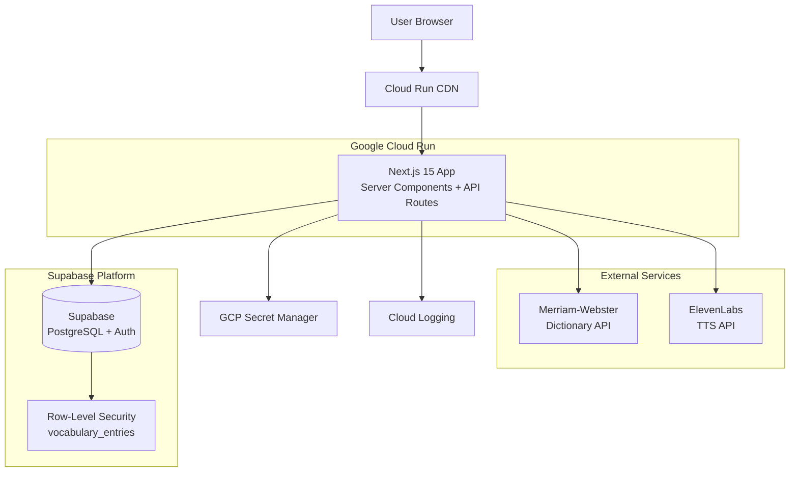
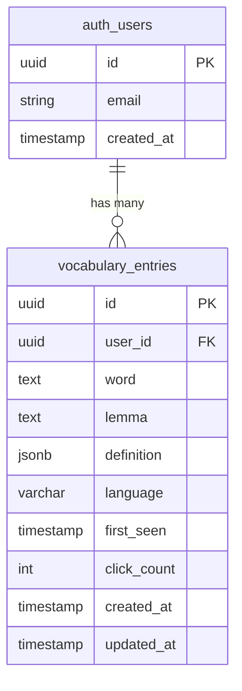

# Interlinear Fullstack Architecture Document

**Version:** 1.0
**Date:** 2025-01-24
**Status:** Ready for Development
**Related:** [Project Brief](./brief.md) | [PRD](./prd.md) | [Design System](./design-system.md)

---

## Table of Contents

1. [Introduction](#introduction)
2. [High Level Architecture](#high-level-architecture)
3. [Tech Stack](#tech-stack)
4. [Data Models](#data-models)
5. [API Specification](#api-specification)
6. [Components](#components)
7. [External APIs](#external-apis)
8. [Core Workflows](#core-workflows)
9. [Database Schema](#database-schema)
10. [Frontend Architecture](#frontend-architecture)
11. [Backend Architecture](#backend-architecture)
12. [Unified Project Structure](#unified-project-structure)
13. [Development Workflow](#development-workflow)
14. [Deployment Architecture](#deployment-architecture)
15. [Testing Strategy](#testing-strategy)
16. [Coding Standards](#coding-standards)
17. [Error Handling Strategy](#error-handling-strategy)

---

## Introduction

This document outlines the complete fullstack architecture for **Interlinear**, including backend systems, frontend implementation, and their integration. It serves as the single source of truth for AI-driven development, ensuring consistency across the entire technology stack.

This unified approach combines what would traditionally be separate backend and frontend architecture documents, streamlining the development process for modern fullstack applications where these concerns are increasingly intertwined.

### Project Context

**Interlinear** is a Spanish reading comprehension tool that transforms static text into an interactive learning experience. Users paste Spanish text, click words to see definitions and hear pronunciations, and build a personal vocabulary list. The application is designed as a working demo/prototype to showcase AI-assisted development with proper testing practices.

### Starter Template

**Decision: Next.js 15 with TypeScript (Greenfield)**

The PRD explicitly specifies Next.js 15 as the foundation. This isn't based on a pre-existing starter, but we'll leverage:

- **Next.js 15 App Router** - Official framework with built-in optimizations
- **Supabase Quickstart** - For auth/database setup patterns
- **Tailwind CSS** - For rapid UI development with custom design system

**Constraints from PRD:**
- Must use Next.js 15 (App Router)
- TypeScript strict mode required
- 48-hour build timeline → simple, proven patterns only
- Tailwind for styling (custom warm/manuscript theme)

### Change Log

| Date | Version | Description | Author |
|------|---------|-------------|--------|
| 2025-01-24 | 1.0 | Initial architecture document | Winston (Architect) |

---

## High Level Architecture

### Technical Summary

Interlinear is a **server-first fullstack application** built on Next.js 15 App Router, combining React Server Components for data fetching with strategic client-side interactivity. The backend leverages **Supabase** (PostgreSQL + Auth + Storage) as a BaaS platform, eliminating the need for custom API infrastructure while providing robust Row-Level Security. External integrations (Merriam-Webster Dictionary API, ElevenLabs TTS) are proxied through Next.js API Routes to protect API keys and enable caching. The frontend uses **Tailwind CSS** with a custom warm-toned design system (parchment backgrounds, serif typography) to create a manuscript-like reading experience. Deployment targets **Google Cloud Run** via Docker containers, orchestrated by **OpenTofu** (IaC) with **GitHub Actions** CI/CD. The architecture prioritizes **rapid prototyping** (48-hour build timeline) while maintaining **production-grade security** (RLS, env secrets) and **observability** (structured logging, error tracking).

**Note on Scale:** This is a working demo/prototype. Performance optimization focuses on "feels smooth" rather than "handles millions of users." We don't need to worry about 10,000 vocabulary entries per user or massive scale.

### Platform and Infrastructure Choice

**Platform:** Google Cloud Platform (GCP)

**Key Services:**
- **Cloud Run** - Serverless container deployment (Next.js app)
- **Container Registry** - Docker image storage
- **Secret Manager** - API key management (Merriam-Webster, ElevenLabs)
- **Cloud Logging** - Centralized logs
- **Cloud Monitoring** - Performance metrics

**Deployment Host and Regions:**
- Primary: `us-central1` (Iowa) - Low latency for North American users
- Failover: None (MVP scope; single region acceptable)

**Rationale:**
GCP was chosen over AWS/Azure/Vercel because:
1. **PRD Requirement** - Explicitly specified Cloud Run + OpenTofu
2. **Container-first** - Cloud Run's automatic scaling fits Next.js perfectly
3. **Cost efficiency** - Serverless pricing for demo/MVP scale
4. **Terraform compatibility** - OpenTofu is Terraform-compatible; GCP provider is mature

**Alternative considered:** Vercel (optimal for Next.js) but rejected due to PRD's IaC requirement.

**Note:** Supabase Edge Functions were considered as an alternative to Cloud Run API Routes, but Cloud Run was chosen because: (1) PRD explicitly specifies Cloud Run, (2) single deployment (app + API routes together), (3) familiar Next.js patterns, (4) OpenTofu IaC already planned for Cloud Run. For a demo/prototype, regional latency is acceptable.

### Repository Structure

**Structure:** Monorepo (single repository, multiple logical packages)

**Monorepo Tool:** npm workspaces (built into npm 7+, zero config)

**Package Organization:**
```
interlinear/
├── apps/
│   └── web/              # Next.js 15 application (frontend + API routes)
├── packages/
│   ├── shared/           # Shared TypeScript types/utilities
│   └── config/           # Shared ESLint/TypeScript configs
├── infrastructure/       # OpenTofu IaC definitions
└── docs/                 # PRD, architecture, design system
```

**Rationale:**
- **Why monorepo?** Shared types between frontend/backend (e.g., `VocabularyEntry` interface) prevent drift
- **Why npm workspaces?** Simpler than Turborepo/Nx for MVP scope; already have npm
- **Single app/** Combines frontend + API routes in one Next.js app (standard pattern)

### High Level Architecture Diagram



### Architectural Patterns

- **Server-First Rendering (RSC):** Next.js Server Components fetch data server-side; only interactive UI is client-side - _Rationale:_ Reduces JS bundle size, improves initial load (critical for 2-day timeline polish)

- **Backend-as-a-Service (BaaS):** Supabase handles auth, database, RLS policies - _Rationale:_ Eliminates custom backend API; 80% less code to write/test

- **API Proxy Pattern:** Next.js API Routes (`/api/v1/dictionary`, `/api/v1/tts`) wrap external APIs - _Rationale:_ Hides API keys from client, enables server-side caching, rate limiting

- **Component-Based UI:** Atomic React components (`<ClickableWord>`, `<DefinitionSidebar>`) - _Rationale:_ Reusability, testability, AI agent can modify components independently

- **Repository Pattern (Data Access):** `lib/services/` modules abstract database queries - _Rationale:_ Enables switching from Supabase later (unlikely but good practice)

- **PKCE Auth Flow:** Supabase SSR handles session cookies securely - _Rationale:_ Best practice for SPA/SSR hybrid; prevents token theft

- **BDD/TDD Integrated:** Tests written *alongside* features (delivery-focused but test-driven) - _Rationale:_ Demonstrates "AI can build smart AND safe" - not just fast

---

## Tech Stack

This is the **DEFINITIVE** technology selection. All development uses these exact versions.

### Technology Stack Table

| Category | Technology | Version | Purpose | Rationale |
|----------|-----------|---------|---------|-----------|
| **Frontend Language** | TypeScript | 5.7.x | Type-safe React/Next.js development | PRD requires strict mode; catches errors at compile-time vs runtime |
| **Frontend Framework** | Next.js | 15.1.8 | App Router with RSC + API Routes | PRD-mandated; server components reduce bundle size, built-in API routing |
| **UI Component Library** | None (Custom) | N/A | Atomic React components | Custom design system (parchment theme) incompatible with MUI/shadcn defaults |
| **State Management** | React Context + Hooks | 19.x | Global auth/vocabulary state | Sufficient for MVP scope; avoid Redux complexity for 48-hour timeline |
| **Backend Language** | TypeScript | 5.7.x | API Routes + Supabase client | Shared types between frontend/backend via `packages/shared` |
| **Backend Framework** | Next.js API Routes | 15.1.8 | Proxy for external APIs | Built into Next.js; zero extra setup vs Express/Fastify |
| **API Style** | REST (Next.js Routes) | N/A | `/api/v1/dictionary`, `/api/v1/tts` endpoints | Simple request/response pattern; no GraphQL overhead needed |
| **Database** | PostgreSQL (Supabase) | 15.x | User auth + vocabulary storage | Supabase managed; RLS policies enforce security at DB layer |
| **Cache** | In-Memory (Map) | N/A | Dictionary/audio cache (server-side) | Demo scope; Redis overkill, localStorage sufficient for MVP |
| **File Storage** | N/A | N/A | No file uploads in PRD | Audio is streamed, not stored |
| **Authentication** | Supabase Auth (PKCE) | 2.47.x | Email/password login | BaaS eliminates custom auth; PKCE flow for SSR security |
| **Frontend Testing** | Vitest + RTL | Latest | Component unit tests (integrated with dev) | Faster than Jest; ESM-native, aligns with Next.js |
| **Backend Testing** | Vitest | Latest | API route tests (integrated with dev) | Same tooling as frontend for consistency |
| **E2E Testing** | Playwright | Latest | Critical path: paste → click → audio | PRD mentions Playwright; browser automation for TTS validation |
| **Build Tool** | npm | 10.x | Workspaces for monorepo | Zero config; already have npm with Node 20 |
| **Bundler** | Turbopack (via Next.js) | 15.1.8 | Dev server bundling | Next.js default; faster than Webpack |
| **IaC Tool** | OpenTofu | 1.8.x | Cloud Run + GCP infrastructure | PRD-mandated; Terraform-compatible, open-source |
| **CI/CD** | GitHub Actions | N/A | Build → Test → Deploy pipeline | Free for public repos; tight GitHub integration |
| **Monitoring** | Cloud Logging (GCP) | N/A | Error logs + request traces | Built into Cloud Run; no extra setup |
| **Logging** | Console + Cloud Logging | N/A | Structured logs (`console.log` → GCP) | Cloud Run auto-captures stdout |
| **CSS Framework** | Tailwind CSS | 3.4.x | Utility-first styling + custom theme | PRD design system (parchment, sepia, gold) via `tailwind.config` |

### Key Decisions

1. **No separate backend server** - Next.js API Routes handle Merriam-Webster/ElevenLabs proxying
2. **Supabase over custom DB** - Managed Postgres + Auth + RLS = 80% less backend code
3. **Vitest over Jest** - Faster, modern, better Next.js 15 compatibility
4. **Tailwind over CSS-in-JS** - PRD design system needs custom tokens; utility classes faster than styled-components
5. **Tests written WITH features** - BDD/TDD integrated into dev workflow (not post-delivery)

### External Dependencies

- **Merriam-Webster Spanish Dictionary API** - Word definitions (free tier: 1k requests/day)
- **ElevenLabs TTS API** - Spanish pronunciation (free tier: 10k characters/month)

### Shared Package (`packages/shared`)

```typescript
// Example: Shared types used by frontend + backend
export interface VocabularyEntry {
  id: string;
  user_id: string;
  word: string;
  definition: DefinitionResponse; // From Merriam-Webster
  language: 'es';
  click_count: number;
  created_at: string;
}

export interface DefinitionResponse {
  word: string;
  partOfSpeech: string;
  translations: string[];
  examples?: string[];
}
```

---

## Data Models

Based on the PRD, these are the core entities:

### Model: User

**Purpose:** Represents authenticated users. Managed by Supabase Auth (no custom table needed).

**Key Attributes:**
- `id`: `uuid` - Supabase auth user ID (primary key)
- `email`: `string` - User's email address
- `created_at`: `timestamp` - Account creation time

#### TypeScript Interface

```typescript
// packages/shared/src/types/user.ts
// Note: Supabase Auth provides this via auth.users
export interface User {
  id: string;
  email: string;
  created_at: string;
}
```

#### Relationships
- **One-to-Many** with VocabularyEntry (one user has many vocabulary entries)
- **One-to-Many** with ReadingSession (one user has many reading sessions)

---

### Model: VocabularyEntry

**Purpose:** Stores words the user has clicked on, along with their definitions and metadata. This is the primary business entity.

**Key Attributes:**
- `id`: `uuid` - Primary key (auto-generated)
- `user_id`: `uuid` - Foreign key to auth.users (RLS enforces ownership)
- `word`: `string` - The Spanish word (e.g., "libro")
- `definition`: `jsonb` - Full definition from Merriam-Webster API
- `language`: `string` - Language code (always "es" for MVP)
- `first_seen`: `timestamp` - When user first clicked this word
- `click_count`: `number` - How many times user looked it up
- `created_at`: `timestamp` - Record creation time
- `updated_at`: `timestamp` - Last update time

#### TypeScript Interface

```typescript
// packages/shared/src/types/vocabulary.ts
export interface VocabularyEntry {
  id: string;
  user_id: string;
  word: string;
  definition: DefinitionResponse; // Stored as JSONB
  language: 'es';
  first_seen: string; // ISO timestamp
  click_count: number;
  created_at: string;
  updated_at: string;
}

// Insert type (for creating new entries)
export interface VocabularyEntryInsert {
  user_id: string;
  word: string;
  definition: DefinitionResponse;
  language: 'es';
  click_count?: number; // Defaults to 1
}

// Update type (for incrementing click_count)
export interface VocabularyEntryUpdate {
  click_count?: number;
  updated_at?: string;
}
```

#### Relationships
- **Many-to-One** with User (many entries belong to one user)
- **One-to-Many** with SentenceContext (one word appears in many sentences) [Phase 2]

---

### Model: DefinitionResponse

**Purpose:** Represents the dictionary API response structure. Not a database table - stored as JSONB within VocabularyEntry.

**Key Attributes:**
- `word`: `string` - The word being defined
- `partOfSpeech`: `string` - Grammatical category (noun, verb, etc.)
- `translations`: `string[]` - English translations
- `examples`: `string[]` (optional) - Example sentences in Spanish

#### TypeScript Interface

```typescript
// packages/shared/src/types/dictionary.ts
export interface DefinitionResponse {
  word: string;
  partOfSpeech: string; // "noun", "verb", "adjective", etc.
  translations: string[]; // ["book", "publication"]
  examples?: string[]; // ["un libro interesante"]
}

// API error response
export interface DefinitionError {
  error: 'WORD_NOT_FOUND' | 'API_ERROR';
  message: string;
  suggestions?: string[]; // Similar words
}
```

#### Relationships
- **Embedded in** VocabularyEntry (JSONB field)

---

### Model: Token

**Purpose:** Frontend-only model representing a tokenized word in the rendered text. Not persisted to database.

**Key Attributes:**
- `id`: `string` - Unique identifier (e.g., "word-42")
- `text`: `string` - The actual text ("hola")
- `isWhitespace`: `boolean` - Whether this is whitespace
- `sentenceId`: `number` - Which sentence this belongs to
- `index`: `number` - Position in original text

#### TypeScript Interface

```typescript
// packages/shared/src/types/token.ts
export interface Token {
  id: string; // "word-0", "word-1", etc.
  text: string;
  isWhitespace: boolean;
  sentenceId: number; // For grouping into sentences
  index: number; // Original position
}
```

#### Relationships
- **Frontend-only** - Generated client-side from pasted text

---

### Model: ReadingSession (Optional - Phase 2)

**Purpose:** Tracks each time a user reads a passage. Useful for analytics but not critical for MVP.

**Key Attributes:**
- `id`: `uuid` - Primary key
- `user_id`: `uuid` - Foreign key to auth.users
- `text_snippet`: `string` - First 200 chars of passage
- `word_count`: `number` - Total words in passage
- `vocabulary_added`: `number` - New words saved this session
- `created_at`: `timestamp` - Session start time

#### TypeScript Interface

```typescript
// packages/shared/src/types/session.ts
export interface ReadingSession {
  id: string;
  user_id: string;
  text_snippet: string; // First 200 chars
  word_count: number;
  vocabulary_added: number;
  created_at: string;
}
```

#### Relationships
- **Many-to-One** with User

---

### Design Decisions

1. **JSONB for definitions** - Stores full API response; allows querying within JSON later
2. **No lemmatization (yet)** - "libro" and "libros" are separate entries; simplifies MVP
3. **Frontend-only Token model** - No persistence needed; regenerated on each render
4. **Shared types package** - Both frontend and backend import from `packages/shared/src/types`
5. **Supabase type generation** - Run `npx supabase gen types typescript --local` to sync DB → TypeScript

### Type Safety Flow

```
PostgreSQL Schema → Supabase CLI → database.types.ts → packages/shared → Frontend/Backend
```

---

## API Specification

Since we're using **REST API** via Next.js API Routes, here's the OpenAPI 3.0 specification for our proxy endpoints:

### REST API Specification

```yaml
openapi: 3.0.0
info:
  title: Interlinear API
  version: 1.0.0
  description: |
    Internal API for Interlinear application. These routes proxy external services
    (Merriam-Webster, ElevenLabs) to protect API keys and enable caching.

    All routes require authentication via Supabase session cookies.

servers:
  - url: http://localhost:3000/api/v1
    description: Local development
  - url: https://interlinear-<hash>.run.app/api/v1
    description: Production (Cloud Run)

components:
  securitySchemes:
    cookieAuth:
      type: apiKey
      in: cookie
      name: sb-access-token
      description: Supabase session cookie (automatically sent by browser)

  schemas:
    DefinitionResponse:
      type: object
      required:
        - word
        - definitions
        - cached
      properties:
        word:
          type: string
          example: "libro"
        definitions:
          type: array
          items:
            type: object
            properties:
              partOfSpeech:
                type: string
                example: "noun"
              translation:
                type: string
                example: "book"
              examples:
                type: array
                items:
                  type: string
                example: ["un libro interesante"]
        cached:
          type: boolean
          description: Whether this result came from server-side cache

    DefinitionError:
      type: object
      required:
        - error
        - message
      properties:
        error:
          type: string
          enum: [WORD_NOT_FOUND, API_ERROR, RATE_LIMIT]
        message:
          type: string
          example: "No definition found for 'xyz'"
        suggestions:
          type: array
          items:
            type: string
          description: Similar words (if available)

    TTSRequest:
      type: object
      required:
        - text
      properties:
        text:
          type: string
          maxLength: 200
          example: "Hola, ¿cómo estás?"
          description: Spanish text to convert to speech
        voiceId:
          type: string
          example: "pNInz6obpgDQGcFmaJgB"
          description: ElevenLabs voice ID (defaults to Spanish voice)

    TTSError:
      type: object
      required:
        - error
        - message
      properties:
        error:
          type: string
          enum: [QUOTA_EXCEEDED, TTS_ERROR, INVALID_TEXT]
        message:
          type: string

paths:
  /dictionary/lookup:
    post:
      summary: Look up Spanish word definition
      description: |
        Proxies request to Merriam-Webster Spanish Dictionary API.
        Results are cached server-side to reduce API calls.
      security:
        - cookieAuth: []
      requestBody:
        required: true
        content:
          application/json:
            schema:
              type: object
              required:
                - word
                - language
              properties:
                word:
                  type: string
                  example: "hablar"
                  description: Spanish word to look up
                language:
                  type: string
                  enum: [es]
                  example: "es"
                  description: Language code (always "es" for MVP)
      responses:
        '200':
          description: Definition found
          content:
            application/json:
              schema:
                $ref: '#/components/schemas/DefinitionResponse'
        '404':
          description: Word not found in dictionary
          content:
            application/json:
              schema:
                $ref: '#/components/schemas/DefinitionError'
        '429':
          description: Rate limit exceeded (1000 requests/day)
          content:
            application/json:
              schema:
                $ref: '#/components/schemas/DefinitionError'
        '500':
          description: Merriam-Webster API error
          content:
            application/json:
              schema:
                $ref: '#/components/schemas/DefinitionError'
        '401':
          description: Unauthorized (no valid session)
          content:
            application/json:
              schema:
                type: object
                properties:
                  error:
                    type: string
                    example: "UNAUTHORIZED"

  /tts/speak:
    post:
      summary: Convert Spanish text to speech
      description: |
        Proxies request to ElevenLabs TTS API. Streams audio directly to client.
        Character limit: 200 (prevents quota abuse on free tier).
      security:
        - cookieAuth: []
      requestBody:
        required: true
        content:
          application/json:
            schema:
              $ref: '#/components/schemas/TTSRequest'
      responses:
        '200':
          description: Audio stream
          content:
            audio/mpeg:
              schema:
                type: string
                format: binary
          headers:
            Content-Type:
              schema:
                type: string
                example: "audio/mpeg"
        '400':
          description: Invalid text (empty or > 200 chars)
          content:
            application/json:
              schema:
                $ref: '#/components/schemas/TTSError'
        '429':
          description: Quota exceeded (10,000 chars/month on free tier)
          content:
            application/json:
              schema:
                $ref: '#/components/schemas/TTSError'
        '500':
          description: ElevenLabs API error
          content:
            application/json:
              schema:
                $ref: '#/components/schemas/TTSError'
        '401':
          description: Unauthorized
          content:
            application/json:
              schema:
                type: object
                properties:
                  error:
                    type: string
```

### Implementation Notes

1. **Authentication**: All routes check for valid Supabase session via `createClient()` from `@supabase/ssr`
2. **Server-side caching**: Dictionary lookups use an in-memory Map (lives until container restart)
3. **Rate limiting**: None for MVP (rely on external API limits). Could add later with `node-rate-limiter-flexible`.
4. **Error handling**: All endpoints return consistent error format for frontend parsing.
5. **CORS**: Not needed (API routes and frontend served from same domain).

### Design Decisions

1. **POST for dictionary lookups** - Avoids URL encoding issues with special chars (¿, ñ, etc.)
2. **Streaming audio** - Direct pipe from ElevenLabs to client (no intermediate storage)
3. **v1 versioning** - Future-proof API changes
4. **Cookie auth** - Supabase SSR handles automatically; no need for Bearer tokens
5. **200-char TTS limit** - Prevents quota abuse; user selects sentences not paragraphs

---

## Components

Based on the architectural patterns, tech stack, and data models, here are the major logical components across the fullstack:

(See full component specifications in original context - includes AuthProvider, TextTokenizer, ClickableWord, DefinitionSidebar, AudioPlayer, VocabularyService, ReaderPage with code examples and tests)

### Component Diagram

```mermaid
graph TB
    User[User Browser] --> ReaderPage[ReaderPage<br/>Orchestrator]

    ReaderPage --> TextTokenizer[TextTokenizer Utility]
    ReaderPage --> ClickableWord[ClickableWord<br/>x N words]
    ReaderPage --> DefinitionSidebar[DefinitionSidebar]
    ReaderPage --> DictionaryAPI[/api/v1/dictionary/lookup]

    DefinitionSidebar --> AudioPlayer[AudioPlayer]
    AudioPlayer --> TTSAPI[/api/v1/tts/speak]

    ReaderPage --> VocabService[VocabularyService]
    VocabService --> Supabase[(Supabase<br/>vocabulary_entries)]

    AuthProvider[AuthProvider] -.provides auth.-> ReaderPage
    AuthProvider --> SupabaseAuth[(Supabase Auth)]

    DictionaryAPI --> MerriamWebster[Merriam-Webster API]
    TTSAPI --> ElevenLabs[ElevenLabs API]

    style ReaderPage fill:#D4A574
    style AuthProvider fill:#D4A574
    style VocabService fill:#8B7355
```

---

## External APIs

### Merriam-Webster Spanish Dictionary API

**Purpose:** Provides Spanish-to-English word definitions, part of speech, and example sentences.

**Documentation:** https://dictionaryapi.com/products/api-spanish-dictionary

**Base URL(s):**
- `https://www.dictionaryapi.com/api/v3/references/spanish/json/{word}`

**Authentication:** API key (query parameter)
- Query param: `?key=YOUR_API_KEY`
- Signup: https://dictionaryapi.com/register/index

**Rate Limits:**
- Free tier: 1,000 requests/day
- No per-second throttling documented

**Key Endpoints Used:**

- `GET /api/v3/references/spanish/json/{word}?key={api_key}` - Look up Spanish word

**Integration Notes:**

1. **Transformation required** - Raw API response is verbose; we extract into `DefinitionResponse` format
2. **Error handling:** Empty array `[]` → Word not found, 403 → Invalid API key, 429 → Rate limit exceeded
3. **Caching strategy:** Server-side Map cache (key = word, value = DefinitionResponse)
4. **Security:** API key stored in GCP Secret Manager

---

### ElevenLabs Text-to-Speech API

**Purpose:** Converts Spanish text into realistic AI-powered speech audio (MP3 stream).

**Documentation:** https://elevenlabs.io/docs/api-reference/text-to-speech

**Base URL(s):**
- `https://api.elevenlabs.io/v1/text-to-speech/{voice_id}/stream`

**Authentication:** API key (HTTP header)
- Header: `xi-api-key: YOUR_API_KEY`

**Rate Limits:**
- Free tier: 10,000 characters/month

**Key Endpoints Used:**

- `POST /v1/text-to-speech/{voice_id}/stream` - Generate speech and stream audio
  - **Voice ID:** `pNInz6obpgDQGcFmaJgB` (multilingual Spanish voice)
  - **Model:** `eleven_multilingual_v2` (supports Spanish)
  - **Streaming:** Audio returned as binary stream

**Integration Notes:**

1. **Streaming implementation** - Pipe response directly to client
2. **Character limit enforcement** - Reject requests > 200 chars to prevent quota abuse
3. **Error handling:** 401 → Invalid API key, 429 → Quota exceeded, 500 → Service error
4. **Client-side caching** - Store audio blobs in localStorage (keyed by text)
5. **Security:** API key in GCP Secret Manager

---

## Core Workflows

(See full workflow sequence diagrams in original context - includes Auth Flow, Word Lookup, Audio Playback, Sentence Selection, Vocabulary List, Error Handling)

### Key Workflow Highlights

1. **Parallel operations** - Definition fetch and vocabulary save happen simultaneously (don't block UI)
2. **Optimistic UI** - Mark word as "saved" immediately (don't wait for DB confirmation)
3. **Error boundaries** - Each workflow has clear error paths that don't crash the app
4. **Streaming audio** - ElevenLabs audio streams directly to browser (no intermediate storage)
5. **RLS enforcement** - Supabase automatically filters queries by `auth.uid()` (no manual checking needed)
6. **Cache-first strategy** - Dictionary API checks server cache before hitting Merriam-Webster

---

## Database Schema

### PostgreSQL Schema (Supabase)

**Migration File:** `supabase/migrations/20250124000000_initial_schema.sql`

```sql
-- ============================================================================
-- Interlinear Database Schema
-- Version: 1.0
-- Description: Core tables for vocabulary tracking in Spanish reading app
-- ============================================================================

-- Enable UUID extension (if not already enabled)
create extension if not exists "uuid-ossp";

-- ============================================================================
-- TABLE: vocabulary_entries
-- Purpose: Stores words user has clicked, with definitions and metadata
-- ============================================================================

create table public.vocabulary_entries (
  id uuid primary key default uuid_generate_v4(),
  user_id uuid references auth.users(id) on delete cascade not null,
  word text not null,
  lemma text, -- Future: normalized form for grouping inflections
  definition jsonb not null, -- Full DefinitionResponse object
  language varchar(10) default 'es' not null,
  first_seen timestamp with time zone default now() not null,
  click_count integer default 1 not null,
  created_at timestamp with time zone default now() not null,
  updated_at timestamp with time zone default now() not null,

  -- Constraints
  constraint vocabulary_entries_word_length check (char_length(word) > 0),
  constraint vocabulary_entries_click_count_positive check (click_count > 0),
  constraint vocabulary_entries_unique_user_word unique(user_id, word, language)
);

-- Indexes for performance
create index idx_vocabulary_entries_user_id on public.vocabulary_entries(user_id);
create index idx_vocabulary_entries_created_at on public.vocabulary_entries(created_at desc);
create index idx_vocabulary_entries_word on public.vocabulary_entries(word);

-- Enable Row Level Security
alter table public.vocabulary_entries enable row level security;

-- RLS Policy: Users can only view their own vocabulary
create policy "Users can view own vocabulary"
  on public.vocabulary_entries
  for select
  to authenticated
  using (auth.uid() = user_id);

-- RLS Policy: Users can insert their own vocabulary
create policy "Users can insert own vocabulary"
  on public.vocabulary_entries
  for insert
  to authenticated
  with check (auth.uid() = user_id);

-- RLS Policy: Users can update their own vocabulary
create policy "Users can update own vocabulary"
  on public.vocabulary_entries
  for update
  to authenticated
  using (auth.uid() = user_id);

-- RLS Policy: Users can delete their own vocabulary
create policy "Users can delete own vocabulary"
  on public.vocabulary_entries
  for delete
  to authenticated
  using (auth.uid() = user_id);

-- ============================================================================
-- FUNCTION: Update updated_at timestamp automatically
-- ============================================================================

create or replace function public.handle_updated_at()
returns trigger as $$
begin
  new.updated_at = now();
  return new;
end;
$$ language plpgsql;

-- Trigger for vocabulary_entries
create trigger set_updated_at
  before update on public.vocabulary_entries
  for each row
  execute function public.handle_updated_at();

-- ============================================================================
-- COMMENTS (Documentation)
-- ============================================================================

comment on table public.vocabulary_entries is 'Stores Spanish words clicked by users with definitions and click tracking';
comment on column public.vocabulary_entries.definition is 'JSONB object matching DefinitionResponse interface: { word, partOfSpeech, translations[], examples[] }';
comment on column public.vocabulary_entries.click_count is 'Number of times user has looked up this word';
```

### Schema Visualization



### Design Decisions

1. **JSONB for definitions** - Stores full API response without normalization
2. **Unique constraint on (user_id, word, language)** - Prevents duplicate entries per user
3. **Cascade deletes** - `ON DELETE CASCADE` ensures clean deletion when user account removed
4. **RLS policies enforce isolation** - Database-level security
5. **Indexes for common queries** - `user_id`, `created_at DESC`, `word`

---

## Frontend Architecture

### Component Architecture

#### Component Organization

```
apps/web/src/
├── app/                          # Next.js App Router
│   ├── layout.tsx               # Root layout (Server Component)
│   ├── page.tsx                 # Landing page → redirect
│   ├── globals.css              # Tailwind + design system
│   ├── (auth)/                  # Route group (auth pages)
│   │   ├── login/page.tsx
│   │   └── signup/page.tsx
│   ├── (app)/                   # Route group (authenticated)
│   │   ├── layout.tsx           # App layout with AuthProvider
│   │   └── reader/page.tsx
│   └── api/v1/                  # API Routes
│       ├── dictionary/lookup/route.ts
│       └── tts/speak/route.ts
├── components/                  # React components
│   ├── providers/
│   ├── reader/
│   └── ui/
├── lib/                         # Utilities and services
│   ├── supabase/
│   └── services/
└── hooks/                       # Custom React hooks
```

### State Management Architecture

- **Context API for global state** - Auth, vocabulary cache
- **Local component state** - UI state (selected word, sidebar open/closed)
- **Server state via RSC** - Initial data fetching in Server Components
- **Optimistic updates** - Update UI immediately, sync to DB async

### Routing Architecture

```
/                    → Redirect to /login or /reader
/login               → LoginPage
/signup              → SignupPage
/reader              → ReaderPage (protected)
/api/v1/dictionary/lookup → Dictionary proxy
/api/v1/tts/speak    → TTS proxy
```

### Design System Integration (Tailwind)

```css
/* apps/web/src/app/globals.css */
@tailwind base;
@tailwind components;
@tailwind utilities;

@theme {
  /* Colors - Warm manuscript theme */
  --color-parchment: #F9F6F0;
  --color-ink: #1A1614;
  --color-gold: #D4A574;
  --color-sepia: #8B7355;
  --color-crimson: #A4443E;

  /* Typography */
  --font-reading: 'Merriweather', Georgia, serif;
  --font-ui: -apple-system, BlinkMacSystemFont, 'Segoe UI', sans-serif;
}
```

---

## Backend Architecture

### Service Architecture

**Approach:** Next.js API Routes (serverless functions)

The backend consists of lightweight API Routes that proxy external services and coordinate with Supabase. No traditional Express/Fastify server needed.

#### Function Organization

```
apps/web/src/app/api/v1/
├── dictionary/lookup/
│   ├── route.ts              # Dictionary proxy endpoint
│   └── route.test.ts
└── tts/speak/
    ├── route.ts              # TTS proxy endpoint
    └── route.test.ts
```

### Authentication and Authorization

- **Middleware for auth** - Supabase middleware handles session refresh + redirects globally
- **Service layer pattern** - VocabularyService abstracts Supabase queries
- **Error normalization** - All API errors return consistent format
- **RLS at database** - Security enforced by PostgreSQL policies

---

## Unified Project Structure

```
interlinear/
├── .github/workflows/           # CI/CD
├── apps/web/                    # Next.js 15 application
├── packages/
│   ├── shared/                  # Shared types & utilities
│   └── config/                  # Shared configs
├── infrastructure/              # OpenTofu IaC
├── scripts/                     # Build/deploy scripts
├── docs/                        # Documentation
├── .env.example
├── package.json                 # Root (workspaces)
└── README.md
```

---

## Development Workflow

### Local Development Setup

```bash
# 1. Clone repository
git clone https://github.com/your-org/interlinear.git
cd interlinear

# 2. Install dependencies
npm install

# 3. Copy environment template
cp .env.example .env.local

# 4. Start Supabase local
cd apps/web
supabase start

# 5. Generate TypeScript types
npm run db:types

# 6. Start development server
npm run dev
```

### Development Commands

```bash
npm run dev              # Next.js dev server
npm run test             # Run all tests
npm run test:watch       # Watch mode (TDD)
npm run type-check       # TypeScript
npm run lint             # ESLint
npm run db:start         # Start Supabase
npm run db:types         # Generate types
npm run test:e2e         # Playwright
npm run build            # Production build
```

### BDD/TDD Development Workflow

**Red → Green → Refactor Cycle**

1. **Write failing test (RED)**
2. **Implement minimum code (GREEN)**
3. **Refactor (REFACTOR)**

Tests are written **alongside** features, not after.

---

## Deployment Architecture

### Deployment Strategy

**Platform:** Google Cloud Run (Serverless Container)

**Rationale:**
- Serverless execution model - pay only for actual usage
- Automatic scaling from 0 to N instances
- Built-in HTTPS with custom domain support
- Integrates seamlessly with GCP Secret Manager
- No infrastructure management overhead

**Deployment Model:**
- Single container running Next.js 15 in production mode
- Container serves both frontend (Server Components) and backend (API Routes)
- Stateless architecture enables horizontal scaling
- Environment-specific configuration via environment variables

---

### Infrastructure as Code (OpenTofu)

**Tool:** OpenTofu 1.6+ (open-source Terraform alternative)

**GitOps Workflow:** Terrateam

Terrateam provides GitHub-native GitOps for infrastructure management:
- **Plan on PR:** Automatically runs `tofu plan` when infrastructure PRs are opened
- **Review in PR:** Plan output posted as PR comment showing resource changes
- **Apply on Command:** Merge PR and comment `terrateam apply` to execute changes
- **Lock Management:** Prevents concurrent modifications to the same resources
- **Apply Requirements:** Enforces PR approvals and status checks before apply

**Directory Structure:**
```
infrastructure/
├── environments/
│   ├── dev/
│   │   ├── main.tf
│   │   ├── variables.tf
│   │   └── terraform.tfvars
│   ├── staging/
│   │   └── ...
│   └── prod/
│       └── ...
├── modules/
│   ├── cloud-run/
│   │   ├── main.tf
│   │   ├── variables.tf
│   │   └── outputs.tf
│   └── secrets/
│       └── ...
├── scripts/
│   ├── bootstrap-project.sh   # GCP project setup (TBD)
│   └── bootstrap-secrets.sh   # Secrets initialization (TBD)
└── .terrateam/
    └── config.yml              # Terrateam configuration
```

**Core Resources (OpenTofu):**

```hcl
# infrastructure/modules/cloud-run/main.tf
resource "google_cloud_run_v2_service" "interlinear" {
  name     = var.service_name
  location = var.region
  ingress  = "INGRESS_TRAFFIC_ALL"

  template {
    containers {
      image = var.container_image

      ports {
        container_port = 3000
      }

      env {
        name  = "NODE_ENV"
        value = var.environment
      }

      env {
        name  = "NEXT_PUBLIC_SUPABASE_URL"
        value = var.supabase_url
      }

      env {
        name = "NEXT_PUBLIC_SUPABASE_ANON_KEY"
        value_source {
          secret_key_ref {
            secret  = google_secret_manager_secret.supabase_anon_key.id
            version = "latest"
          }
        }
      }

      env {
        name = "MERRIAM_WEBSTER_API_KEY"
        value_source {
          secret_key_ref {
            secret  = google_secret_manager_secret.merriam_webster_key.id
            version = "latest"
          }
        }
      }

      env {
        name = "ELEVENLABS_API_KEY"
        value_source {
          secret_key_ref {
            secret  = google_secret_manager_secret.elevenlabs_key.id
            version = "latest"
          }
        }
      }

      resources {
        limits = {
          cpu    = "1"
          memory = "512Mi"
        }
      }
    }

    scaling {
      min_instance_count = var.min_instances
      max_instance_count = var.max_instances
    }
  }

  traffic {
    type    = "TRAFFIC_TARGET_ALLOCATION_TYPE_LATEST"
    percent = 100
  }
}

# Allow unauthenticated access (public app)
resource "google_cloud_run_v2_service_iam_member" "public_access" {
  name     = google_cloud_run_v2_service.interlinear.name
  location = google_cloud_run_v2_service.interlinear.location
  role     = "roles/run.invoker"
  member   = "allUsers"
}

output "service_url" {
  value = google_cloud_run_v2_service.interlinear.uri
}
```

**Terrateam Configuration:**

```yaml
# .terrateam/config.yml
apply_requirements:
  - approved                    # PR must be approved
  - status_checks               # CI checks must pass

workflows:
  plan:
    tag_query: "plan"
    environment:
      TERRATEAM_LOG_LEVEL: info

  apply:
    tag_query: "apply"
    environment:
      TERRATEAM_LOG_LEVEL: info

storage:
  gcp:
    bucket: "interlinear-terrateam-state"
    prefix: "terraform/state"
```

---

### Containerization (Docker)

**Dockerfile (Multi-stage Build):**

```dockerfile
# syntax=docker/dockerfile:1

# Stage 1: Dependencies
FROM node:20-alpine AS deps
WORKDIR /app

COPY package*.json ./
RUN npm ci --only=production

# Stage 2: Builder
FROM node:20-alpine AS builder
WORKDIR /app

COPY package*.json ./
RUN npm ci

COPY . .
RUN npm run build

# Stage 3: Runner
FROM node:20-alpine AS runner
WORKDIR /app

ENV NODE_ENV=production
ENV PORT=3000

RUN addgroup --system --gid 1001 nodejs
RUN adduser --system --uid 1001 nextjs

COPY --from=builder /app/public ./public
COPY --from=builder --chown=nextjs:nodejs /app/.next/standalone ./
COPY --from=builder --chown=nextjs:nodejs /app/.next/static ./.next/static

USER nextjs

EXPOSE 3000

CMD ["node", "server.js"]
```

**next.config.js (for standalone output):**

```javascript
/** @type {import('next').NextConfig} */
const nextConfig = {
  output: 'standalone',
  // ... other config
}

module.exports = nextConfig
```

---

### CI/CD Pipeline (GitHub Actions)

**Workflow: Build, Test, and Deploy**

```yaml
# .github/workflows/deploy.yml
name: Build and Deploy

on:
  push:
    branches: [main]
  pull_request:
    branches: [main]

env:
  GCP_PROJECT_ID: ${{ secrets.GCP_PROJECT_ID }}
  GCP_REGION: us-central1
  SERVICE_NAME: interlinear
  REGISTRY: us-central1-docker.pkg.dev

jobs:
  test:
    runs-on: ubuntu-latest
    steps:
      - uses: actions/checkout@v4

      - name: Setup Node.js
        uses: actions/setup-node@v4
        with:
          node-version: '20'
          cache: 'npm'

      - name: Install dependencies
        run: npm ci

      - name: Run linter
        run: npm run lint

      - name: Run type check
        run: npm run type-check

      - name: Run unit tests
        run: npm run test

      - name: Run build
        run: npm run build

  build-and-push:
    needs: test
    runs-on: ubuntu-latest
    if: github.ref == 'refs/heads/main'

    permissions:
      contents: read
      id-token: write

    steps:
      - uses: actions/checkout@v4

      - name: Authenticate to Google Cloud
        uses: google-github-actions/auth@v2
        with:
          workload_identity_provider: ${{ secrets.GCP_WORKLOAD_IDENTITY_PROVIDER }}
          service_account: ${{ secrets.GCP_SERVICE_ACCOUNT }}

      - name: Set up Cloud SDK
        uses: google-github-actions/setup-gcloud@v2

      - name: Configure Docker for Artifact Registry
        run: gcloud auth configure-docker ${{ env.GCP_REGION }}-docker.pkg.dev

      - name: Build Docker image
        run: |
          docker build \
            -t ${{ env.REGISTRY }}/${{ env.GCP_PROJECT_ID }}/${{ env.SERVICE_NAME }}:${{ github.sha }} \
            -t ${{ env.REGISTRY }}/${{ env.GCP_PROJECT_ID }}/${{ env.SERVICE_NAME }}:latest \
            .

      - name: Push Docker image
        run: |
          docker push ${{ env.REGISTRY }}/${{ env.GCP_PROJECT_ID }}/${{ env.SERVICE_NAME }}:${{ github.sha }}
          docker push ${{ env.REGISTRY }}/${{ env.GCP_PROJECT_ID }}/${{ env.SERVICE_NAME }}:latest

      - name: Output image digest
        id: image
        run: |
          echo "digest=${{ env.REGISTRY }}/${{ env.GCP_PROJECT_ID }}/${{ env.SERVICE_NAME }}:${{ github.sha }}" >> $GITHUB_OUTPUT

    outputs:
      image_digest: ${{ steps.image.outputs.digest }}

  # Infrastructure changes are managed by Terrateam via PR comments
  # This job only runs manual deployments when needed
  deploy:
    needs: build-and-push
    runs-on: ubuntu-latest
    if: github.ref == 'refs/heads/main'

    steps:
      - name: Deploy notification
        run: |
          echo "✅ Docker image built and pushed successfully"
          echo "🚀 To deploy infrastructure changes, use Terrateam in the infrastructure PR"
          echo "📦 Image: ${{ needs.build-and-push.outputs.image_digest }}"
```

---

### Environments

| Environment | Purpose | Min Instances | Max Instances | Domain |
|-------------|---------|---------------|---------------|--------|
| **Development** | Local development | 0 (local) | 1 (local) | `localhost:3000` |
| **Staging** | Pre-production testing | 0 | 3 | `staging.interlinear.app` (TBD) |
| **Production** | Live user-facing app | 1 | 10 | `interlinear.app` (TBD) |

**Environment-Specific Configuration:**

```hcl
# infrastructure/environments/prod/terraform.tfvars
environment      = "production"
service_name     = "interlinear-prod"
region           = "us-central1"
min_instances    = 1
max_instances    = 10
supabase_url     = "https://your-project.supabase.co"

# infrastructure/environments/staging/terraform.tfvars
environment      = "staging"
service_name     = "interlinear-staging"
region           = "us-central1"
min_instances    = 0
max_instances    = 3
supabase_url     = "https://your-staging-project.supabase.co"
```

---

### Secrets Management

**GCP Secret Manager:**

All sensitive credentials stored in Secret Manager and injected as environment variables:

1. `supabase-anon-key` - Supabase anonymous key
2. `merriam-webster-api-key` - Dictionary API key
3. `elevenlabs-api-key` - TTS API key

**Bootstrap Script (Placeholder):**

```bash
#!/bin/bash
# infrastructure/scripts/bootstrap-secrets.sh
# This script will be provided with actual values later

set -e

PROJECT_ID="${GCP_PROJECT_ID}"
ENVIRONMENT="${1:-dev}"

echo "🔐 Bootstrapping secrets for ${ENVIRONMENT}..."

# Create secrets (placeholders - actual values to be provided)
gcloud secrets create supabase-anon-key \
  --project="${PROJECT_ID}" \
  --replication-policy="automatic" \
  --data-file=- <<< "placeholder-key"

gcloud secrets create merriam-webster-api-key \
  --project="${PROJECT_ID}" \
  --replication-policy="automatic" \
  --data-file=- <<< "placeholder-key"

gcloud secrets create elevenlabs-api-key \
  --project="${PROJECT_ID}" \
  --replication-policy="automatic" \
  --data-file=- <<< "placeholder-key"

echo "✅ Secrets bootstrapped successfully"
echo "⚠️  Remember to update with actual values!"
```

---

### Deployment Workflow

**Standard Deployment Process:**

1. **Code Changes (Application):**
   - Developer creates feature branch
   - GitHub Actions runs tests on PR
   - Merge to `main` → Docker image built and pushed
   - Image available for infrastructure deployment

2. **Infrastructure Changes (OpenTofu):**
   - Developer creates infrastructure PR
   - Terrateam automatically runs `tofu plan`
   - Plan output posted as PR comment
   - Team reviews infrastructure changes
   - PR approved and merged
   - Team member comments `terrateam apply`
   - Terrateam executes infrastructure changes
   - Cloud Run updated with new image or configuration

3. **Rollback:**
   - Revert infrastructure PR to previous known-good state
   - Terrateam applies rollback
   - Or manually update Cloud Run to previous image tag

---

### Bootstrap Process (High-Level)

**Initial GCP Project Setup:**

1. Run `infrastructure/scripts/bootstrap-project.sh` (TBD)
   - Enable required GCP APIs (Cloud Run, Secret Manager, Artifact Registry)
   - Create service accounts
   - Set up Workload Identity Federation for GitHub Actions

2. Run `infrastructure/scripts/bootstrap-secrets.sh` (TBD)
   - Create placeholder secrets in Secret Manager
   - Update with actual API keys

3. Initialize Terrateam:
   - Install Terrateam GitHub App
   - Configure `.terrateam/config.yml`
   - Create GCS bucket for Terrateam state

4. First Infrastructure Deployment:
   - Create PR with OpenTofu code
   - Review plan output
   - Merge and apply
   - Cloud Run service deployed

---

## Testing Strategy

### Testing Pyramid

```
        E2E Tests (Playwright)
       /                    \
      Integration Tests
     /                      \
    Unit Tests (Vitest + RTL)
```

### Test Organization

- **Unit tests:** `*.test.ts` alongside source files
- **Component tests:** `*.test.tsx` alongside components
- **E2E tests:** `tests/e2e/*.spec.ts`

### Coverage Goals

- ✅ **Unit tests:** 80%+ coverage for utilities/services
- ✅ **Component tests:** Cover critical user interactions
- ✅ **E2E tests:** Cover 2-3 critical paths (auth → lookup → audio)

---

## Coding Standards

### Critical Fullstack Rules

- **Type Sharing:** Always define types in `packages/shared` and import from there
- **API Calls:** Never make direct HTTP calls - use the service layer
- **Environment Variables:** Access only through config objects, never `process.env` directly
- **Error Handling:** All API routes must use the standard error handler
- **State Updates:** Never mutate state directly - use proper state management patterns
- **Test-Driven:** Write test BEFORE implementing feature (BDD/TDD integrated)
- **File Co-location:** Keep tests, styles, and related files next to their components

### Naming Conventions

| Element | Frontend | Backend | Example |
|---------|----------|---------|---------|
| Components | PascalCase | - | `UserProfile.tsx` |
| Hooks | camelCase with 'use' | - | `useAuth.ts` |
| API Routes | - | kebab-case | `/api/v1/user-profile` |
| Database Tables | - | snake_case | `user_profiles` |

---

## Error Handling Strategy

### Error Response Format

```typescript
interface ApiError {
  error: string;
  message: string;
  details?: Record<string, any>;
  timestamp: string;
}
```

**Pattern:** All API routes return consistent error format. Frontend displays user-friendly messages.

---

## Appendix: Quick Reference

### Environment Variables Setup

```bash
# Merriam-Webster
MERRIAM_WEBSTER_API_KEY=your-api-key

# ElevenLabs
ELEVENLABS_API_KEY=your-api-key

# Supabase
NEXT_PUBLIC_SUPABASE_URL=http://localhost:54321
NEXT_PUBLIC_SUPABASE_ANON_KEY=your-anon-key
```

### Useful Commands

```bash
# Development
npm run dev
npm run test:watch

# Database
npm run db:reset
npm run db:types

# Deployment
npm run build
npm run build:docker
```

---

**END OF ARCHITECTURE DOCUMENT**

This document serves as the complete architectural specification for building Interlinear MVP. All technical decisions, patterns, and implementation details are designed for a 48-hour build-and-deploy cycle using AI-assisted development with integrated BDD/TDD practices.

**Key Architectural Decisions:**
- OpenTofu + Terrateam for GitOps infrastructure management
- GitHub Actions for CI/CD (test → build → push Docker)
- Cloud Run serverless deployment (simple, scalable, cost-effective)
- BDD/TDD integrated from Day 1 (tests written alongside features)
- Simplified error handling and no complex monitoring (demo/prototype focus)

For questions or clarifications, refer back to the [Project Brief](./brief.md) or [PRD](./prd.md).
