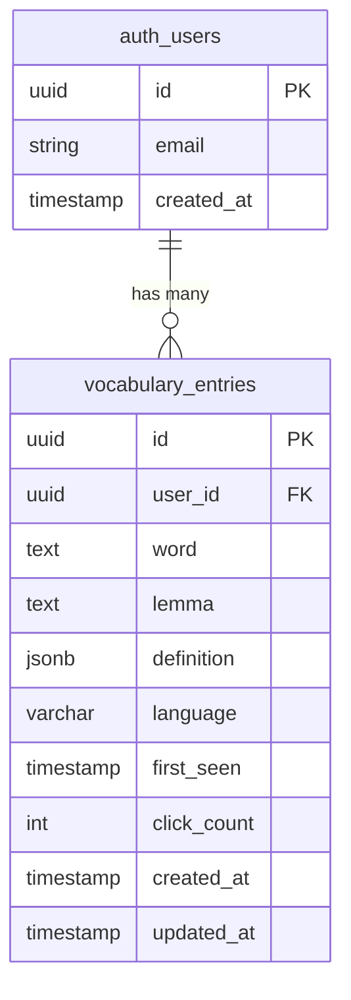

# Database Schema

## PostgreSQL Schema (Supabase)

**Migration File:** `supabase/migrations/20250124000000_initial_schema.sql`

```sql
-- ============================================================================
-- Interlinear Database Schema
-- Version: 1.0
-- Description: Core tables for vocabulary tracking in Spanish reading app
-- ============================================================================

-- Enable UUID extension (if not already enabled)
create extension if not exists "uuid-ossp";

-- ============================================================================
-- TABLE: vocabulary_entries
-- Purpose: Stores words user has clicked, with definitions and metadata
-- ============================================================================

create table public.vocabulary_entries (
  id uuid primary key default uuid_generate_v4(),
  user_id uuid references auth.users(id) on delete cascade not null,
  word text not null,
  lemma text, -- Future: normalized form for grouping inflections
  definition jsonb not null, -- Full DefinitionResponse object
  language varchar(10) default 'es' not null,
  first_seen timestamp with time zone default now() not null,
  click_count integer default 1 not null,
  created_at timestamp with time zone default now() not null,
  updated_at timestamp with time zone default now() not null,

  -- Constraints
  constraint vocabulary_entries_word_length check (char_length(word) > 0),
  constraint vocabulary_entries_click_count_positive check (click_count > 0),
  constraint vocabulary_entries_unique_user_word unique(user_id, word, language)
);

-- Indexes for performance
create index idx_vocabulary_entries_user_id on public.vocabulary_entries(user_id);
create index idx_vocabulary_entries_created_at on public.vocabulary_entries(created_at desc);
create index idx_vocabulary_entries_word on public.vocabulary_entries(word);

-- Enable Row Level Security
alter table public.vocabulary_entries enable row level security;

-- RLS Policy: Users can only view their own vocabulary
create policy "Users can view own vocabulary"
  on public.vocabulary_entries
  for select
  to authenticated
  using (auth.uid() = user_id);

-- RLS Policy: Users can insert their own vocabulary
create policy "Users can insert own vocabulary"
  on public.vocabulary_entries
  for insert
  to authenticated
  with check (auth.uid() = user_id);

-- RLS Policy: Users can update their own vocabulary
create policy "Users can update own vocabulary"
  on public.vocabulary_entries
  for update
  to authenticated
  using (auth.uid() = user_id);

-- RLS Policy: Users can delete their own vocabulary
create policy "Users can delete own vocabulary"
  on public.vocabulary_entries
  for delete
  to authenticated
  using (auth.uid() = user_id);

-- ============================================================================
-- FUNCTION: Update updated_at timestamp automatically
-- ============================================================================

create or replace function public.handle_updated_at()
returns trigger as $$
begin
  new.updated_at = now();
  return new;
end;
$$ language plpgsql;

-- Trigger for vocabulary_entries
create trigger set_updated_at
  before update on public.vocabulary_entries
  for each row
  execute function public.handle_updated_at();

-- ============================================================================
-- COMMENTS (Documentation)
-- ============================================================================

comment on table public.vocabulary_entries is 'Stores Spanish words clicked by users with definitions and click tracking';
comment on column public.vocabulary_entries.definition is 'JSONB object matching DefinitionResponse interface: { word, partOfSpeech, translations[], examples[] }';
comment on column public.vocabulary_entries.click_count is 'Number of times user has looked up this word';
```

## Schema Visualization



## Design Decisions

1. **JSONB for definitions** - Stores full API response without normalization
2. **Unique constraint on (user_id, word, language)** - Prevents duplicate entries per user
3. **Cascade deletes** - `ON DELETE CASCADE` ensures clean deletion when user account removed
4. **RLS policies enforce isolation** - Database-level security
5. **Indexes for common queries** - `user_id`, `created_at DESC`, `word`

---
