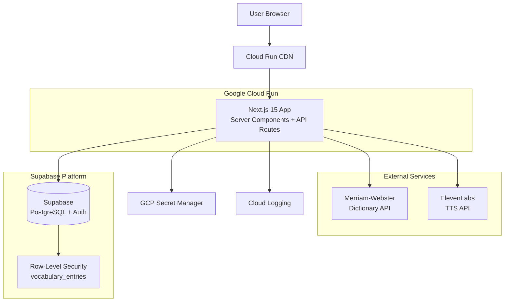

# High Level Architecture

## Technical Summary

Interlinear is a **server-first fullstack application** built on Next.js 15 App Router, combining React Server Components for data fetching with strategic client-side interactivity. The backend leverages **Supabase** (PostgreSQL + Auth + Storage) as a BaaS platform, eliminating the need for custom API infrastructure while providing robust Row-Level Security. External integrations (Merriam-Webster Dictionary API, ElevenLabs TTS) are proxied through Next.js API Routes to protect API keys and enable caching. The frontend uses **Tailwind CSS** with a custom warm-toned design system (parchment backgrounds, serif typography) to create a manuscript-like reading experience. Deployment targets **Google Cloud Run** via Docker containers, orchestrated by **OpenTofu** (IaC) with **GitHub Actions** CI/CD. The architecture prioritizes **rapid prototyping** (48-hour build timeline) while maintaining **production-grade security** (RLS, env secrets) and **observability** (structured logging, error tracking).

**Note on Scale:** This is a working demo/prototype. Performance optimization focuses on "feels smooth" rather than "handles millions of users." We don't need to worry about 10,000 vocabulary entries per user or massive scale.

## Platform and Infrastructure Choice

**Platform:** Google Cloud Platform (GCP)

**Key Services:**
- **Cloud Run** - Serverless container deployment (Next.js app)
- **Container Registry** - Docker image storage
- **Secret Manager** - API key management (Merriam-Webster, ElevenLabs)
- **Cloud Logging** - Centralized logs
- **Cloud Monitoring** - Performance metrics

**Deployment Host and Regions:**
- Primary: `us-central1` (Iowa) - Low latency for North American users
- Failover: None (MVP scope; single region acceptable)

**Rationale:**
GCP was chosen over AWS/Azure/Vercel because:
1. **PRD Requirement** - Explicitly specified Cloud Run + OpenTofu
2. **Container-first** - Cloud Run's automatic scaling fits Next.js perfectly
3. **Cost efficiency** - Serverless pricing for demo/MVP scale
4. **Terraform compatibility** - OpenTofu is Terraform-compatible; GCP provider is mature

**Alternative considered:** Vercel (optimal for Next.js) but rejected due to PRD's IaC requirement.

**Note:** Supabase Edge Functions were considered as an alternative to Cloud Run API Routes, but Cloud Run was chosen because: (1) PRD explicitly specifies Cloud Run, (2) single deployment (app + API routes together), (3) familiar Next.js patterns, (4) OpenTofu IaC already planned for Cloud Run. For a demo/prototype, regional latency is acceptable.

## Repository Structure

**Structure:** Monorepo (single repository, multiple logical packages)

**Monorepo Tool:** npm workspaces (built into npm 7+, zero config)

**Package Organization:**
```
interlinear/
├── apps/
│   └── web/              # Next.js 15 application (frontend + API routes)
├── packages/
│   ├── shared/           # Shared TypeScript types/utilities
│   └── config/           # Shared ESLint/TypeScript configs
├── infrastructure/       # OpenTofu IaC definitions
└── docs/                 # PRD, architecture, design system
```

**Rationale:**
- **Why monorepo?** Shared types between frontend/backend (e.g., `VocabularyEntry` interface) prevent drift
- **Why npm workspaces?** Simpler than Turborepo/Nx for MVP scope; already have npm
- **Single app/** Combines frontend + API routes in one Next.js app (standard pattern)

## High Level Architecture Diagram



## Architectural Patterns

- **Server-First Rendering (RSC):** Next.js Server Components fetch data server-side; only interactive UI is client-side - _Rationale:_ Reduces JS bundle size, improves initial load (critical for 2-day timeline polish)

- **Backend-as-a-Service (BaaS):** Supabase handles auth, database, RLS policies - _Rationale:_ Eliminates custom backend API; 80% less code to write/test

- **API Proxy Pattern:** Next.js API Routes (`/api/v1/dictionary`, `/api/v1/tts`) wrap external APIs - _Rationale:_ Hides API keys from client, enables server-side caching, rate limiting

- **Component-Based UI:** Atomic React components (`<ClickableWord>`, `<DefinitionSidebar>`) - _Rationale:_ Reusability, testability, AI agent can modify components independently

- **Repository Pattern (Data Access):** `lib/services/` modules abstract database queries - _Rationale:_ Enables switching from Supabase later (unlikely but good practice)

- **PKCE Auth Flow:** Supabase SSR handles session cookies securely - _Rationale:_ Best practice for SPA/SSR hybrid; prevents token theft

- **BDD/TDD Integrated:** Tests written *alongside* features (delivery-focused but test-driven) - _Rationale:_ Demonstrates "AI can build smart AND safe" - not just fast

---
